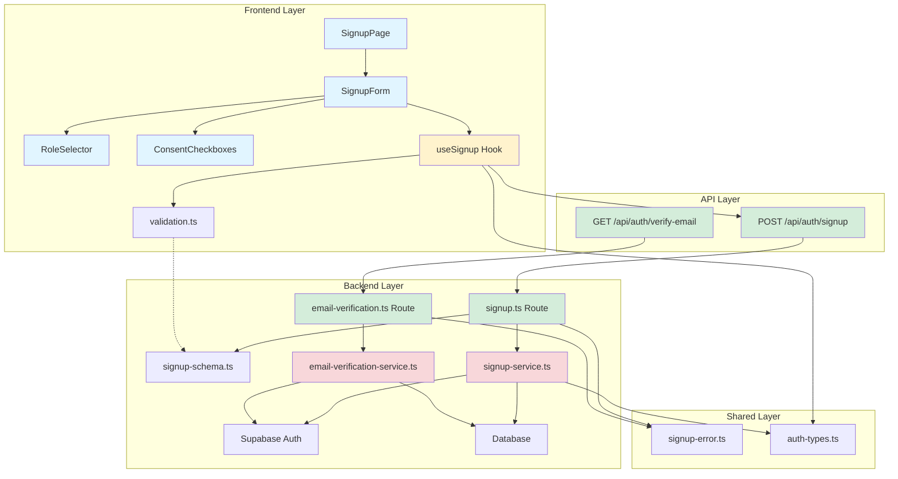
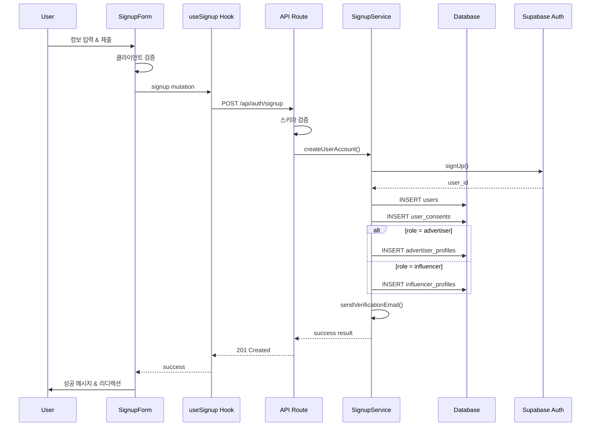

{"error":{"code":"UNAUTHORIZED","message":"인증이 필요합니다"}}# UC-001: 회원가입 & 역할선택 - 구현 계획

## 개요

### 모듈 목록

| 모듈 | 위치 | 설명 |
|------|------|------|
| **Backend - API Routes** | `src/features/auth/backend/routes/signup.ts` | 회원가입 API 라우트 핸들러 |
| **Backend - Services** | `src/features/auth/backend/services/signup-service.ts` | 회원가입 비즈니스 로직 |
| **Backend - Services** | `src/features/auth/backend/services/email-verification-service.ts` | 이메일 검증 로직 |
| **Backend - Schema** | `src/features/auth/backend/schema/signup-schema.ts` | 회원가입 요청/응답 스키마 (Zod) |
| **Backend - Error** | `src/features/auth/backend/errors/signup-error.ts` | 회원가입 에러 코드 정의 |
| **Frontend - Pages** | `src/app/signup/page.tsx` | 회원가입 페이지 컴포넌트 |
| **Frontend - Components** | `src/features/auth/components/SignupForm.tsx` | 회원가입 폼 컴포넌트 |
| **Frontend - Components** | `src/features/auth/components/RoleSelector.tsx` | 역할 선택 컴포넌트 |
| **Frontend - Components** | `src/features/auth/components/ConsentCheckboxes.tsx` | 약관 동의 체크박스 |
| **Frontend - Hooks** | `src/features/auth/hooks/useSignup.ts` | 회원가입 React Query 훅 |
| **Frontend - Lib** | `src/features/auth/lib/validation.ts` | 클라이언트 측 유효성 검사 유틸 |
| **Shared - Types** | `src/features/auth/types/auth-types.ts` | 인증 관련 타입 정의 |
| **Database Types** | `src/lib/supabase/types.ts` | Supabase 데이터베이스 타입 (확장) |

---

## Diagram

### 모듈 간 관계도



### 데이터 흐름



---

## Implementation Plan

### 1. Backend - Schema Definitions

#### `src/features/auth/backend/schema/signup-schema.ts`

```typescript
import { z } from 'zod';

// 회원가입 요청 스키마
export const SignupRequestSchema = z.object({
  name: z.string()
    .min(2, '이름은 2자 이상이어야 합니다')
    .max(100, '이름은 100자 이하여야 합니다')
    .regex(/^[가-힣a-zA-Z\s]+$/, '이름은 한글 또는 영문만 가능합니다'),
  
  phone: z.string()
    .regex(/^010-?\d{4}-?\d{4}$/, '올바른 휴대폰 번호 형식이 아닙니다')
    .transform(val => val.replace(/-/g, '')), // 정규화
  
  email: z.string()
    .email('올바른 이메일 형식이 아닙니다')
    .toLowerCase(),
  
  password: z.string()
    .min(8, '비밀번호는 8자 이상이어야 합니다')
    .regex(/^(?=.*[a-zA-Z])(?=.*\d)|(?=.*[a-zA-Z])(?=.*[!@#$%^&*])|(?=.*\d)(?=.*[!@#$%^&*])/, 
      '비밀번호는 영문, 숫자, 특수문자 중 2가지 이상 조합이어야 합니다'),
  
  role: z.enum(['advertiser', 'influencer'], {
    errorMap: () => ({ message: '역할을 선택해주세요' })
  }),
  
  consents: z.object({
    termsOfService: z.literal(true, {
      errorMap: () => ({ message: '서비스 이용약관에 동의해주세요' })
    }),
    privacyPolicy: z.literal(true, {
      errorMap: () => ({ message: '개인정보 처리방침에 동의해주세요' })
    }),
    marketing: z.boolean().optional().default(false),
  }),
});

export type SignupRequest = z.infer<typeof SignupRequestSchema>;

// 회원가입 응답 스키마
export const SignupResponseSchema = z.object({
  userId: z.string().uuid(),
  email: z.string().email(),
  role: z.enum(['advertiser', 'influencer']),
  emailVerificationRequired: z.boolean(),
  redirectUrl: z.string().optional(),
});

export type SignupResponse = z.infer<typeof SignupResponseSchema>;

// 이메일 검증 요청 스키마
export const EmailVerificationRequestSchema = z.object({
  token: z.string().min(1, '검증 토큰이 필요합니다'),
});

export type EmailVerificationRequest = z.infer<typeof EmailVerificationRequestSchema>;
```

**Unit Tests:**
```typescript
describe('SignupRequestSchema', () => {
  it('should validate correct signup data', () => {
    const valid = {
      name: '홍길동',
      phone: '010-1234-5678',
      email: 'test@example.com',
      password: 'Password123!',
      role: 'influencer',
      consents: {
        termsOfService: true,
        privacyPolicy: true,
        marketing: false,
      }
    };
    expect(SignupRequestSchema.parse(valid)).toBeDefined();
  });

  it('should reject name with special characters', () => {
    const invalid = { ...validData, name: '홍길동@#' };
    expect(() => SignupRequestSchema.parse(invalid)).toThrow();
  });

  it('should normalize phone number by removing hyphens', () => {
    const data = { ...validData, phone: '010-1234-5678' };
    const result = SignupRequestSchema.parse(data);
    expect(result.phone).toBe('01012345678');
  });

  it('should reject weak password', () => {
    const invalid = { ...validData, password: '12345678' };
    expect(() => SignupRequestSchema.parse(invalid)).toThrow();
  });

  it('should require mandatory consents', () => {
    const invalid = { ...validData, consents: { ...validData.consents, termsOfService: false } };
    expect(() => SignupRequestSchema.parse(invalid)).toThrow();
  });
});
```

---

### 2. Backend - Error Definitions

#### `src/features/auth/backend/errors/signup-error.ts`

```typescript
export const signupErrorCodes = {
  // 유효성 검사 오류
  invalidInput: 'INVALID_SIGNUP_INPUT',
  
  // 중복 오류
  emailExists: 'EMAIL_ALREADY_EXISTS',
  phoneExists: 'PHONE_ALREADY_EXISTS',
  
  // 인증 오류
  authCreationFailed: 'AUTH_ACCOUNT_CREATION_FAILED',
  emailVerificationFailed: 'EMAIL_VERIFICATION_FAILED',
  
  // 데이터베이스 오류
  userCreationFailed: 'USER_CREATION_FAILED',
  profileCreationFailed: 'PROFILE_CREATION_FAILED',
  consentSaveFailed: 'CONSENT_SAVE_FAILED',
  
  // 레이트 리밋
  rateLimitExceeded: 'RATE_LIMIT_EXCEEDED',
  
  // 기타
  internalError: 'INTERNAL_SERVER_ERROR',
} as const;

export type SignupErrorCode = typeof signupErrorCodes[keyof typeof signupErrorCodes];

export type SignupServiceError = SignupErrorCode;
```

---

### 3. Backend - Service Layer

#### `src/features/auth/backend/services/signup-service.ts`

```typescript
import type { SupabaseClient } from '@supabase/supabase-js';
import {
  failure,
  success,
  type HandlerResult,
} from '@/backend/http/response';
import type { SignupRequest, SignupResponse } from '../schema/signup-schema';
import { signupErrorCodes, type SignupServiceError } from '../errors/signup-error';

/**
 * 이메일 중복 확인
 */
export const checkEmailExists = async (
  client: SupabaseClient,
  email: string
): Promise<boolean> => {
  const { data, error } = await client
    .from('users')
    .select('id')
    .eq('email', email)
    .maybeSingle();
  
  if (error) throw error;
  return data !== null;
};

/**
 * 휴대폰번호 중복 확인
 */
export const checkPhoneExists = async (
  client: SupabaseClient,
  phone: string
): Promise<boolean> => {
  const { data, error } = await client
    .from('users')
    .select('id')
    .eq('phone', phone)
    .maybeSingle();
  
  if (error) throw error;
  return data !== null;
};

/**
 * 회원가입 메인 서비스
 */
export const createUserAccount = async (
  client: SupabaseClient,
  request: SignupRequest
): Promise<HandlerResult<SignupResponse, SignupServiceError, unknown>> => {
  try {
    // 1. 중복 체크
    const [emailExists, phoneExists] = await Promise.all([
      checkEmailExists(client, request.email),
      checkPhoneExists(client, request.phone),
    ]);

    if (emailExists) {
      return failure(400, signupErrorCodes.emailExists, '이미 사용 중인 이메일입니다');
    }

    if (phoneExists) {
      return failure(400, signupErrorCodes.phoneExists, '이미 사용 중인 휴대폰번호입니다');
    }

    // 2. Supabase Auth 계정 생성
    const { data: authData, error: authError } = await client.auth.signUp({
      email: request.email,
      password: request.password,
      options: {
        data: {
          name: request.name,
          phone: request.phone,
          role: request.role,
        },
        emailRedirectTo: `${process.env.NEXT_PUBLIC_APP_URL}/auth/verify`,
      },
    });

    if (authError || !authData.user) {
      return failure(
        500,
        signupErrorCodes.authCreationFailed,
        '계정 생성에 실패했습니다',
        authError
      );
    }

    const userId = authData.user.id;

    // 3. users 테이블 생성
    const { error: userError } = await client
      .from('users')
      .insert({
        id: userId,
        name: request.name,
        phone: request.phone,
        email: request.email,
        role: request.role,
      });

    if (userError) {
      // 롤백: Auth 계정 삭제 필요 (관리자 권한 필요)
      return failure(
        500,
        signupErrorCodes.userCreationFailed,
        '사용자 프로필 생성에 실패했습니다',
        userError
      );
    }

    // 4. 약관 동의 이력 저장
    const consents = [
      { user_id: userId, consent_type: 'terms_of_service', agreed: request.consents.termsOfService },
      { user_id: userId, consent_type: 'privacy_policy', agreed: request.consents.privacyPolicy },
    ];

    if (request.consents.marketing) {
      consents.push({ user_id: userId, consent_type: 'marketing', agreed: true });
    }

    const { error: consentError } = await client
      .from('user_consents')
      .insert(consents);

    if (consentError) {
      return failure(
        500,
        signupErrorCodes.consentSaveFailed,
        '약관 동의 저장에 실패했습니다',
        consentError
      );
    }

    // 5. 역할별 프로필 생성
    if (request.role === 'advertiser') {
      const { error: profileError } = await client
        .from('advertiser_profiles')
        .insert({
          user_id: userId,
          verification_status: 'pending',
        });

      if (profileError) {
        return failure(
          500,
          signupErrorCodes.profileCreationFailed,
          '광고주 프로필 생성에 실패했습니다',
          profileError
        );
      }
    } else {
      const { error: profileError } = await client
        .from('influencer_profiles')
        .insert({
          user_id: userId,
          verification_status: 'pending',
        });

      if (profileError) {
        return failure(
          500,
          signupErrorCodes.profileCreationFailed,
          '인플루언서 프로필 생성에 실패했습니다',
          profileError
        );
      }
    }

    // 6. 성공 응답
    const redirectUrl = request.role === 'advertiser'
      ? '/advertiser/onboarding'
      : '/influencer/onboarding';

    return success<SignupResponse>({
      userId,
      email: request.email,
      role: request.role,
      emailVerificationRequired: true,
      redirectUrl,
    }, 201);

  } catch (error) {
    return failure(
      500,
      signupErrorCodes.internalError,
      '회원가입 처리 중 오류가 발생했습니다',
      error
    );
  }
};
```

**Unit Tests:**
```typescript
describe('SignupService', () => {
  describe('checkEmailExists', () => {
    it('should return true if email exists', async () => {
      // Mock Supabase client
      const result = await checkEmailExists(mockClient, 'existing@example.com');
      expect(result).toBe(true);
    });

    it('should return false if email does not exist', async () => {
      const result = await checkEmailExists(mockClient, 'new@example.com');
      expect(result).toBe(false);
    });
  });

  describe('createUserAccount', () => {
    it('should create user account successfully', async () => {
      const request: SignupRequest = {
        name: '홍길동',
        phone: '01012345678',
        email: 'new@example.com',
        password: 'Password123!',
        role: 'influencer',
        consents: {
          termsOfService: true,
          privacyPolicy: true,
          marketing: false,
        }
      };

      const result = await createUserAccount(mockClient, request);
      
      expect(result.ok).toBe(true);
      if (result.ok) {
        expect(result.data.role).toBe('influencer');
        expect(result.data.emailVerificationRequired).toBe(true);
      }
    });

    it('should fail if email already exists', async () => {
      const request = { ...validRequest, email: 'existing@example.com' };
      const result = await createUserAccount(mockClient, request);
      
      expect(result.ok).toBe(false);
      if (!result.ok) {
        expect(result.error.code).toBe(signupErrorCodes.emailExists);
      }
    });

    it('should create advertiser profile when role is advertiser', async () => {
      const request = { ...validRequest, role: 'advertiser' as const };
      const result = await createUserAccount(mockClient, request);
      
      // Verify advertiser_profiles INSERT was called
      expect(mockClient.from).toHaveBeenCalledWith('advertiser_profiles');
    });
  });
});
```

---

### 4. Backend - API Routes

#### `src/features/auth/backend/routes/signup.ts`

```typescript
import type { Hono } from 'hono';
import {
  failure,
  respond,
  type ErrorResult,
} from '@/backend/http/response';
import {
  getLogger,
  getSupabase,
  type AppEnv,
} from '@/backend/hono/context';
import { SignupRequestSchema } from '../schema/signup-schema';
import { createUserAccount } from '../services/signup-service';
import { signupErrorCodes, type SignupServiceError } from '../errors/signup-error';

export const registerSignupRoutes = (app: Hono<AppEnv>) => {
  /**
   * POST /api/auth/signup
   * 회원가입 엔드포인트
   */
  app.post('/auth/signup', async (c) => {
    const logger = getLogger(c);
    const supabase = getSupabase(c);

    // 1. 요청 바디 파싱 및 검증
    let body;
    try {
      body = await c.req.json();
    } catch {
      return respond(
        c,
        failure(
          400,
          signupErrorCodes.invalidInput,
          '요청 형식이 올바르지 않습니다'
        )
      );
    }

    const parsedBody = SignupRequestSchema.safeParse(body);

    if (!parsedBody.success) {
      return respond(
        c,
        failure(
          400,
          signupErrorCodes.invalidInput,
          '입력 데이터가 유효하지 않습니다',
          parsedBody.error.format()
        )
      );
    }

    // 2. 서비스 호출
    const result = await createUserAccount(supabase, parsedBody.data);

    if (!result.ok) {
      const errorResult = result as ErrorResult<SignupServiceError, unknown>;
      
      // 로깅
      if (errorResult.error.code === signupErrorCodes.internalError) {
        logger.error('Signup failed', errorResult.error);
      } else {
        logger.warn('Signup validation failed', errorResult.error.code);
      }
    } else {
      logger.info('User signed up successfully', { userId: result.data.userId });
    }

    return respond(c, result);
  });
};
```

---

### 5. Frontend - Hooks

#### `src/features/auth/hooks/useSignup.ts`

```typescript
'use client';

import { useMutation } from '@tanstack/react-query';
import { useRouter } from 'next/navigation';
import { apiClient } from '@/lib/remote/api-client';
import type { SignupRequest, SignupResponse } from '../lib/dto';

export const useSignup = () => {
  const router = useRouter();

  return useMutation({
    mutationFn: async (data: SignupRequest): Promise<SignupResponse> => {
      const response = await apiClient.post('/auth/signup', data);
      return response.json();
    },
    onSuccess: (data) => {
      // 성공 시 리디렉션
      if (data.redirectUrl) {
        router.push(data.redirectUrl);
      }
    },
    onError: (error: any) => {
      // 에러 처리는 컴포넌트에서
      console.error('Signup failed:', error);
    },
  });
};
```

**QA Sheet:**
```typescript
// Frontend Hook QA
describe('useSignup Hook', () => {
  it('should call API with correct data', async () => {
    const { result } = renderHook(() => useSignup());
    
    await act(async () => {
      await result.current.mutateAsync(validSignupData);
    });
    
    expect(apiClient.post).toHaveBeenCalledWith('/auth/signup', validSignupData);
  });

  it('should redirect to onboarding page on success', async () => {
    const { result } = renderHook(() => useSignup());
    
    await act(async () => {
      await result.current.mutateAsync(validSignupData);
    });
    
    expect(mockRouter.push).toHaveBeenCalledWith('/influencer/onboarding');
  });

  it('should handle API error gracefully', async () => {
    const { result } = renderHook(() => useSignup());
    
    await act(async () => {
      try {
        await result.current.mutateAsync(invalidData);
      } catch (error) {
        expect(error).toBeDefined();
      }
    });
  });
});
```

---

### 6. Frontend - Components

#### `src/features/auth/components/SignupForm.tsx`

```typescript
'use client';

import { useState } from 'react';
import { useForm } from 'react-hook-form';
import { zodResolver } from '@hookform/resolvers/zod';
import { Button } from '@/components/ui/button';
import { Input } from '@/components/ui/input';
import { Form, FormControl, FormField, FormItem, FormLabel, FormMessage } from '@/components/ui/form';
import { RoleSelector } from './RoleSelector';
import { ConsentCheckboxes } from './ConsentCheckboxes';
import { useSignup } from '../hooks/useSignup';
import { SignupRequestSchema, type SignupRequest } from '../lib/dto';

export const SignupForm = () => {
  const signup = useSignup();
  const [isSubmitting, setIsSubmitting] = useState(false);

  const form = useForm<SignupRequest>({
    resolver: zodResolver(SignupRequestSchema),
    defaultValues: {
      name: '',
      phone: '',
      email: '',
      password: '',
      role: undefined,
      consents: {
        termsOfService: false,
        privacyPolicy: false,
        marketing: false,
      },
    },
  });

  const onSubmit = async (data: SignupRequest) => {
    setIsSubmitting(true);
    try {
      await signup.mutateAsync(data);
    } catch (error) {
      console.error(error);
    } finally {
      setIsSubmitting(false);
    }
  };

  return (
    <Form {...form}>
      <form onSubmit={form.handleSubmit(onSubmit)} className="space-y-6">
        {/* 이름 */}
        <FormField
          control={form.control}
          name="name"
          render={({ field }) => (
            <FormItem>
              <FormLabel>이름</FormLabel>
              <FormControl>
                <Input placeholder="홍길동" {...field} />
              </FormControl>
              <FormMessage />
            </FormItem>
          )}
        />

        {/* 휴대폰번호 */}
        <FormField
          control={form.control}
          name="phone"
          render={({ field }) => (
            <FormItem>
              <FormLabel>휴대폰번호</FormLabel>
              <FormControl>
                <Input placeholder="010-1234-5678" {...field} />
              </FormControl>
              <FormMessage />
            </FormItem>
          )}
        />

        {/* 이메일 */}
        <FormField
          control={form.control}
          name="email"
          render={({ field }) => (
            <FormItem>
              <FormLabel>이메일</FormLabel>
              <FormControl>
                <Input type="email" placeholder="example@email.com" {...field} />
              </FormControl>
              <FormMessage />
            </FormItem>
          )}
        />

        {/* 비밀번호 */}
        <FormField
          control={form.control}
          name="password"
          render={({ field }) => (
            <FormItem>
              <FormLabel>비밀번호</FormLabel>
              <FormControl>
                <Input type="password" placeholder="8자 이상" {...field} />
              </FormControl>
              <FormMessage />
            </FormItem>
          )}
        />

        {/* 역할 선택 */}
        <FormField
          control={form.control}
          name="role"
          render={({ field }) => (
            <FormItem>
              <FormLabel>역할 선택</FormLabel>
              <FormControl>
                <RoleSelector value={field.value} onChange={field.onChange} />
              </FormControl>
              <FormMessage />
            </FormItem>
          )}
        />

        {/* 약관 동의 */}
        <FormField
          control={form.control}
          name="consents"
          render={({ field }) => (
            <FormItem>
              <FormControl>
                <ConsentCheckboxes value={field.value} onChange={field.onChange} />
              </FormControl>
              <FormMessage />
            </FormItem>
          )}
        />

        {/* 제출 버튼 */}
        <Button type="submit" className="w-full" disabled={isSubmitting}>
          {isSubmitting ? '처리 중...' : '회원가입'}
        </Button>

        {/* 에러 메시지 */}
        {signup.isError && (
          <div className="text-sm text-red-600">
            {signup.error?.message || '회원가입에 실패했습니다'}
          </div>
        )}
      </form>
    </Form>
  );
};
```

**QA Sheet:**
```markdown
# SignupForm Component QA Sheet

## Visual Tests
- [ ] 폼이 정상적으로 렌더링되는가?
- [ ] 모든 필드가 올바른 순서로 표시되는가?
- [ ] 플레이스홀더 텍스트가 명확한가?
- [ ] 에러 메시지가 필드 하단에 빨간색으로 표시되는가?
- [ ] 제출 버튼이 명확하게 보이는가?

## Functional Tests
- [ ] 이름 필드에 특수문자 입력 시 에러 메시지가 표시되는가?
- [ ] 휴대폰번호 형식이 잘못되면 에러가 표시되는가?
- [ ] 이메일 형식이 잘못되면 에러가 표시되는가?
- [ ] 비밀번호 강도가 약하면 에러가 표시되는가?
- [ ] 역할을 선택하지 않으면 제출이 차단되는가?
- [ ] 필수 약관에 동의하지 않으면 제출이 차단되는가?
- [ ] 모든 필드가 유효하면 제출 버튼이 활성화되는가?
- [ ] 제출 중에는 버튼이 비활성화되고 "처리 중..." 텍스트가 표시되는가?
- [ ] API 에러 발생 시 에러 메시지가 표시되는가?
- [ ] 성공 시 리디렉션되는가?

## Accessibility Tests
- [ ] 모든 필드에 label이 연결되어 있는가?
- [ ] 키보드로 모든 필드를 탐색할 수 있는가?
- [ ] 스크린 리더가 에러 메시지를 읽을 수 있는가?
- [ ] Focus 상태가 명확한가?

## Responsive Tests
- [ ] 모바일에서 폼이 정상적으로 표시되는가?
- [ ] 태블릿에서 레이아웃이 깨지지 않는가?
- [ ] 작은 화면에서 스크롤이 정상 작동하는가?
```

---

#### `src/features/auth/components/RoleSelector.tsx`

```typescript
'use client';

import { Card } from '@/components/ui/card';
import { UserCircle, Store } from 'lucide-react';

type Role = 'advertiser' | 'influencer';

interface RoleSelectorProps {
  value?: Role;
  onChange: (value: Role) => void;
}

export const RoleSelector = ({ value, onChange }: RoleSelectorProps) => {
  return (
    <div className="grid grid-cols-2 gap-4">
      <Card
        className={`p-4 cursor-pointer transition-all ${
          value === 'influencer' 
            ? 'border-primary bg-primary/5' 
            : 'hover:border-gray-400'
        }`}
        onClick={() => onChange('influencer')}
      >
        <div className="flex flex-col items-center gap-2">
          <UserCircle className="w-12 h-12" />
          <h3 className="font-semibold">인플루언서</h3>
          <p className="text-sm text-gray-600 text-center">
            체험단에 참여하고 리뷰를 작성합니다
          </p>
        </div>
      </Card>

      <Card
        className={`p-4 cursor-pointer transition-all ${
          value === 'advertiser' 
            ? 'border-primary bg-primary/5' 
            : 'hover:border-gray-400'
        }`}
        onClick={() => onChange('advertiser')}
      >
        <div className="flex flex-col items-center gap-2">
          <Store className="w-12 h-12" />
          <h3 className="font-semibold">광고주</h3>
          <p className="text-sm text-gray-600 text-center">
            체험단을 등록하고 관리합니다
          </p>
        </div>
      </Card>
    </div>
  );
};
```

**QA Sheet:**
```markdown
# RoleSelector Component QA Sheet

## Visual Tests
- [ ] 두 개의 카드가 나란히 표시되는가?
- [ ] 아이콘이 명확하게 보이는가?
- [ ] 선택된 카드가 시각적으로 강조되는가?
- [ ] 설명 텍스트가 읽기 쉬운가?

## Functional Tests
- [ ] 인플루언서 카드 클릭 시 선택 상태가 변경되는가?
- [ ] 광고주 카드 클릭 시 선택 상태가 변경되는가?
- [ ] 하나만 선택 가능한가? (라디오 버튼 동작)
- [ ] onChange 콜백이 올바른 값으로 호출되는가?

## Accessibility Tests
- [ ] 키보드로 카드를 선택할 수 있는가?
- [ ] 선택 상태가 스크린 리더에 전달되는가?
- [ ] 카드에 적절한 role 속성이 있는가?

## Responsive Tests
- [ ] 모바일에서 카드가 세로로 쌓이는가?
- [ ] 작은 화면에서 텍스트가 잘리지 않는가?
```

---

#### `src/features/auth/components/ConsentCheckboxes.tsx`

```typescript
'use client';

import { Checkbox } from '@/components/ui/checkbox';
import { Label } from '@/components/ui/label';

interface Consents {
  termsOfService: boolean;
  privacyPolicy: boolean;
  marketing: boolean;
}

interface ConsentCheckboxesProps {
  value: Consents;
  onChange: (value: Consents) => void;
}

export const ConsentCheckboxes = ({ value, onChange }: ConsentCheckboxesProps) => {
  const handleChange = (key: keyof Consents) => (checked: boolean) => {
    onChange({ ...value, [key]: checked });
  };

  return (
    <div className="space-y-3">
      <div className="flex items-start space-x-2">
        <Checkbox
          id="termsOfService"
          checked={value.termsOfService}
          onCheckedChange={handleChange('termsOfService')}
        />
        <Label htmlFor="termsOfService" className="cursor-pointer">
          <span className="text-red-600">*</span> 서비스 이용약관에 동의합니다{' '}
          <a href="/terms" className="text-primary underline" target="_blank">
            (보기)
          </a>
        </Label>
      </div>

      <div className="flex items-start space-x-2">
        <Checkbox
          id="privacyPolicy"
          checked={value.privacyPolicy}
          onCheckedChange={handleChange('privacyPolicy')}
        />
        <Label htmlFor="privacyPolicy" className="cursor-pointer">
          <span className="text-red-600">*</span> 개인정보 처리방침에 동의합니다{' '}
          <a href="/privacy" className="text-primary underline" target="_blank">
            (보기)
          </a>
        </Label>
      </div>

      <div className="flex items-start space-x-2">
        <Checkbox
          id="marketing"
          checked={value.marketing}
          onCheckedChange={handleChange('marketing')}
        />
        <Label htmlFor="marketing" className="cursor-pointer">
          마케팅 정보 수신에 동의합니다 (선택)
        </Label>
      </div>
    </div>
  );
};
```

**QA Sheet:**
```markdown
# ConsentCheckboxes Component QA Sheet

## Visual Tests
- [ ] 세 개의 체크박스가 세로로 정렬되는가?
- [ ] 필수 항목에 빨간 별표(*)가 표시되는가?
- [ ] 링크가 파란색으로 표시되고 밑줄이 있는가?
- [ ] 선택 항목에 "(선택)" 텍스트가 있는가?

## Functional Tests
- [ ] 각 체크박스를 개별적으로 선택/해제할 수 있는가?
- [ ] 약관 링크 클릭 시 새 탭에서 열리는가?
- [ ] onChange 콜백이 올바른 값으로 호출되는가?
- [ ] 라벨 클릭 시 체크박스가 토글되는가?

## Accessibility Tests
- [ ] 각 체크박스에 label이 연결되어 있는가?
- [ ] 키보드로 체크박스를 조작할 수 있는가?
- [ ] 필수/선택 정보가 스크린 리더에 전달되는가?
```

---

### 7. Frontend - Page

#### `src/app/signup/page.tsx`

```typescript
import { Metadata } from 'next';
import { SignupForm } from '@/features/auth/components/SignupForm';
import { Card, CardHeader, CardTitle, CardDescription, CardContent } from '@/components/ui/card';

export const metadata: Metadata = {
  title: '회원가입',
  description: '블로그 체험단 플랫폼 회원가입',
};

export default function SignupPage() {
  return (
    <div className="container max-w-md mx-auto py-12">
      <Card>
        <CardHeader>
          <CardTitle>회원가입</CardTitle>
          <CardDescription>
            블로그 체험단에 오신 것을 환영합니다
          </CardDescription>
        </CardHeader>
        <CardContent>
          <SignupForm />
        </CardContent>
      </Card>
    </div>
  );
}
```

---

### 8. Shared Types

#### `src/features/auth/types/auth-types.ts`

```typescript
export type UserRole = 'advertiser' | 'influencer';

export type VerificationStatus = 'pending' | 'verified' | 'failed';

export interface User {
  id: string;
  name: string;
  phone: string;
  email: string;
  role: UserRole;
  createdAt: string;
  updatedAt: string;
}

export interface UserConsent {
  id: string;
  userId: string;
  consentType: 'terms_of_service' | 'privacy_policy' | 'marketing';
  agreed: boolean;
  agreedAt: string;
}
```

---

### 9. Integration

#### `src/backend/hono/app.ts` (수정)

```typescript
import { Hono } from "hono";
import { errorBoundary } from "@/backend/middleware/error";
import { withAppContext } from "@/backend/middleware/context";
import { withSupabase } from "@/backend/middleware/supabase";
import { registerExampleRoutes } from "@/features/example/backend/route";
import { registerSignupRoutes } from "@/features/auth/backend/routes/signup"; // 추가
import type { AppEnv } from "@/backend/hono/context";

// ... (기존 코드)

export const createHonoApp = () => {
  // ... (기존 코드)

  registerExampleRoutes(app);
  registerSignupRoutes(app); // 추가

  // ... (기존 코드)
};
```

---

## Summary

### 구현 순서

1. **Phase 1: Backend Foundation**
   - Schema 정의 (`signup-schema.ts`)
   - Error 코드 정의 (`signup-error.ts`)
   - Service 로직 구현 (`signup-service.ts`)
   - Unit tests 작성

2. **Phase 2: API Layer**
   - API Route 구현 (`signup.ts`)
   - Hono app에 라우트 등록
   - Integration tests

3. **Phase 3: Frontend Foundation**
   - Types 정의 (`auth-types.ts`)
   - API Hook 구현 (`useSignup.ts`)
   - Validation utils (`validation.ts`)

4. **Phase 4: UI Components**
   - `RoleSelector` 구현 및 QA
   - `ConsentCheckboxes` 구현 및 QA
   - `SignupForm` 구현 및 QA

5. **Phase 5: Page & Integration**
   - Signup page 구현
   - End-to-end testing
   - QA 전체 점검

### 테스트 체크리스트

- [ ] Backend unit tests (Schema validation)
- [ ] Backend unit tests (Service logic)
- [ ] Backend integration tests (API routes)
- [ ] Frontend component tests
- [ ] Frontend hook tests
- [ ] End-to-end tests
- [ ] Manual QA (전체 플로우)

### 주요 고려사항

1. **보안**
   - 비밀번호 최소 요구사항 강제
   - 레이트 리밋 적용 (향후)
   - CSRF 토큰 검증 (Supabase 내장)

2. **UX**
   - 실시간 유효성 검사 피드백
   - 명확한 에러 메시지
   - 로딩 상태 표시
   - 접근성 준수

3. **확장성**
   - 소셜 로그인 추가 용이
   - 다국어 지원 준비
   - 약관 버전 관리 (향후)

