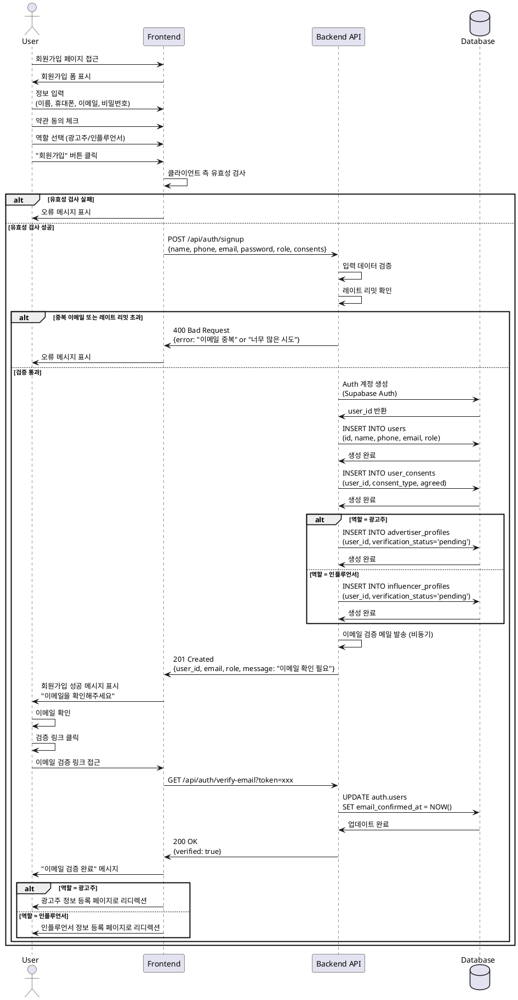

# UC-001: 회원가입 & 역할선택

## Primary Actor
- 신규 사용자 (미가입 상태)

## Precondition
- 사용자가 서비스에 접속 가능한 상태
- 유효한 이메일 주소 또는 소셜 계정 보유
- 약관 동의 가능한 상태

## Trigger
- 사용자가 회원가입 페이지 접근
- "회원가입" 버튼 클릭

## Main Scenario

### 1. 회원가입 정보 입력
1. 사용자가 회원가입 페이지에 접근한다
2. 시스템이 회원가입 폼을 표시한다
3. 사용자가 다음 정보를 입력한다:
   - 이름
   - 휴대폰번호
   - 이메일
   - 비밀번호 (또는 소셜 로그인 선택)
4. 사용자가 약관에 동의한다:
   - 서비스 이용약관 (필수)
   - 개인정보 처리방침 (필수)
   - 마케팅 수신 동의 (선택)
5. 사용자가 역할을 선택한다:
   - 광고주 (Advertiser)
   - 인플루언서 (Influencer)

### 2. 유효성 검사
1. 시스템이 입력 데이터의 유효성을 검사한다:
   - 이름: 2-100자, 특수문자 제한
   - 휴대폰번호: 한국 휴대폰 번호 형식 (010-XXXX-XXXX)
   - 이메일: 이메일 형식, 중복 검사
   - 비밀번호: 8자 이상, 영문/숫자/특수문자 조합
2. 시스템이 레이트 리밋을 확인한다 (봇 방지)

### 3. 계정 생성
1. 시스템이 Supabase Auth를 통해 인증 계정을 생성한다
2. 시스템이 `users` 테이블에 프로필 레코드를 생성한다:
   - id (Auth user ID)
   - name, phone, email
   - role (선택한 역할)
3. 시스템이 `user_consents` 테이블에 약관 동의 이력을 저장한다
4. 시스템이 역할에 따라 초기 프로필 레코드를 생성한다:
   - 광고주: `advertiser_profiles` 레코드 생성 (verification_status = 'pending')
   - 인플루언서: `influencer_profiles` 레코드 생성 (verification_status = 'pending')

### 4. 이메일 검증
1. 시스템이 이메일 검증 메일을 발송한다
2. 사용자에게 "회원가입 완료, 이메일을 확인해주세요" 메시지를 표시한다
3. 사용자가 이메일의 검증 링크를 클릭한다
4. 시스템이 이메일을 검증 완료 처리한다

### 5. 역할별 플로우 분기
1. 시스템이 사용자를 역할별 정보 등록 페이지로 리디렉션한다:
   - 광고주 → 광고주 정보 등록 페이지 (UC-003)
   - 인플루언서 → 인플루언서 정보 등록 페이지 (UC-002)

## Edge Cases

### 이메일 중복
- **발생 조건**: 이미 가입된 이메일로 회원가입 시도
- **처리**: "이미 사용 중인 이메일입니다" 오류 메시지 표시, 로그인 페이지 링크 제공

### 휴대폰번호 중복
- **발생 조건**: 이미 등록된 휴대폰번호로 회원가입 시도
- **처리**: "이미 사용 중인 휴대폰번호입니다" 오류 메시지 표시

### 유효성 검사 실패
- **발생 조건**: 입력 데이터가 형식 요구사항을 충족하지 않음
- **처리**: 해당 필드에 실시간 오류 메시지 표시, 제출 불가

### 약관 미동의
- **발생 조건**: 필수 약관에 동의하지 않고 제출 시도
- **처리**: "필수 약관에 동의해주세요" 메시지 표시, 제출 불가

### 레이트 리밋 초과
- **발생 조건**: 짧은 시간 내 과도한 회원가입 시도 (봇 방지)
- **처리**: "잠시 후 다시 시도해주세요" 메시지 표시, 일정 시간 대기 필요

### 이메일 검증 실패
- **발생 조건**: 검증 링크가 만료되거나 유효하지 않음
- **처리**: "인증 링크가 만료되었습니다" 메시지 표시, 재발송 버튼 제공

### 네트워크 오류
- **발생 조건**: Auth 계정 생성 중 네트워크 오류 발생
- **처리**: "일시적인 오류가 발생했습니다. 다시 시도해주세요" 메시지 표시

### 소셜 로그인 실패
- **발생 조건**: 소셜 계정 연동 중 오류 또는 취소
- **처리**: "소셜 로그인에 실패했습니다" 메시지 표시, 이메일 회원가입 안내

## Business Rules

### BR-001: 이메일 유일성
- 하나의 이메일 주소는 하나의 계정에만 사용 가능
- 중복 이메일 가입 시도는 차단됨

### BR-002: 역할 선택 필수
- 회원가입 시 반드시 역할(광고주/인플루언서)을 선택해야 함
- 역할은 가입 후 변경 불가 (정책)

### BR-003: 필수 약관 동의
- 서비스 이용약관과 개인정보 처리방침은 필수 동의 항목
- 마케팅 수신 동의는 선택 사항

### BR-004: 이메일 검증 필수
- 이메일 검증을 완료해야 서비스 이용 가능
- 미검증 상태에서는 제한된 기능만 사용 가능

### BR-005: 비밀번호 보안 정책
- 최소 8자 이상
- 영문, 숫자, 특수문자 중 2가지 이상 조합
- 일반적인 패턴(1234, password 등) 사용 불가

### BR-006: 휴대폰번호 형식
- 한국 휴대폰 번호 형식만 허용 (010-XXXX-XXXX)
- 숫자만 입력 또는 하이픈 포함 입력 모두 허용 (자동 정규화)

### BR-007: 레이트 리밋
- 동일 IP에서 1분당 최대 3회 회원가입 시도 허용
- 초과 시 5분간 회원가입 차단

### BR-008: 이름 정책
- 2자 이상, 100자 이하
- 한글, 영문만 허용 (특수문자 제외)

### BR-009: 역할별 초기 상태
- 가입 직후 모든 사용자의 검증 상태는 'pending'
- 추가 정보 등록 및 검증 완료 후 'verified' 상태로 전환

### BR-010: 약관 동의 이력 보관
- 모든 약관 동의 내역은 감사를 위해 영구 보관
- 동의 시점, 약관 버전 등 메타데이터 저장

---

## Sequence Diagram

---

## Notes

### 구현 우선순위
1. **High**: 기본 회원가입 플로우 (이메일, 비밀번호, 역할 선택)
2. **High**: 이메일 검증
3. **Medium**: 소셜 로그인 (Google, Kakao 등)
4. **Medium**: 레이트 리밋 및 봇 방지
5. **Low**: 휴대폰번호 인증

### 기술적 고려사항
- Supabase Auth를 활용한 인증 처리
- 클라이언트 측 유효성 검사로 UX 개선
- 서버 측 이중 검증으로 보안 강화
- 이메일 발송은 비동기 처리 (응답 속도 개선)
- 약관 버전 관리 시스템 고려

### UI/UX 고려사항
- 실시간 유효성 검사 피드백
- 비밀번호 강도 표시기
- 약관 내용 모달로 제공
- 역할 선택 시 각 역할에 대한 간단한 설명 제공
- 진행 상태 표시 (Step indicator)

