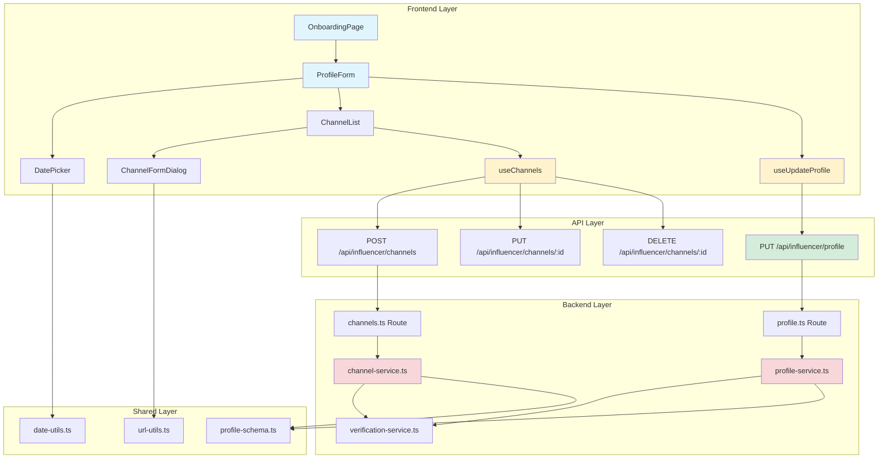
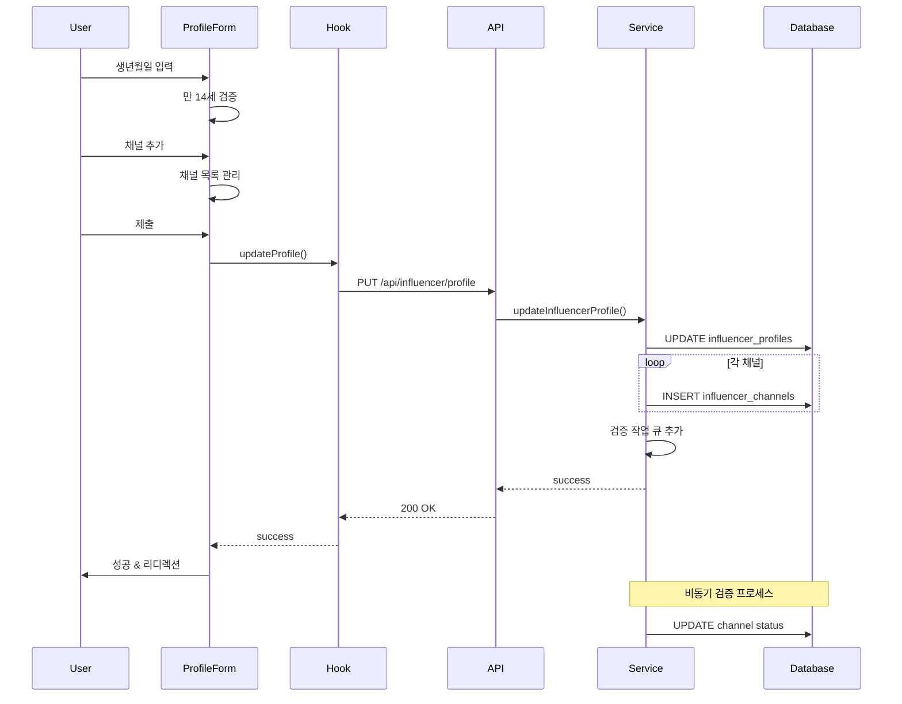

# UC-002: 인플루언서 정보 등록 - 구현 계획

## 개요

### 모듈 목록

| 모듈 | 위치 | 설명 |
|------|------|------|
| **Backend - API Routes** | `src/features/influencer/backend/routes/profile.ts` | 인플루언서 프로필 CRUD API |
| **Backend - Services** | `src/features/influencer/backend/services/profile-service.ts` | 프로필 등록 비즈니스 로직 |
| **Backend - Services** | `src/features/influencer/backend/services/channel-service.ts` | 채널 관리 비즈니스 로직 |
| **Backend - Services** | `src/features/influencer/backend/services/verification-service.ts` | 채널 검증 로직 (비동기) |
| **Backend - Schema** | `src/features/influencer/backend/schema/profile-schema.ts` | 프로필/채널 스키마 (Zod) |
| **Backend - Error** | `src/features/influencer/backend/errors/profile-error.ts` | 에러 코드 정의 |
| **Frontend - Pages** | `src/app/influencer/onboarding/page.tsx` | 인플루언서 온보딩 페이지 |
| **Frontend - Components** | `src/features/influencer/components/ProfileForm.tsx` | 프로필 입력 폼 |
| **Frontend - Components** | `src/features/influencer/components/ChannelList.tsx` | 채널 목록 표시 |
| **Frontend - Components** | `src/features/influencer/components/ChannelFormDialog.tsx` | 채널 추가/수정 Dialog |
| **Frontend - Hooks** | `src/features/influencer/hooks/useUpdateProfile.ts` | 프로필 업데이트 훅 |
| **Frontend - Hooks** | `src/features/influencer/hooks/useChannels.ts` | 채널 CRUD 훅 |
| **Shared - Utils** | `src/lib/utils/date-utils.ts` | 날짜/나이 계산 유틸 |
| **Shared - Utils** | `src/lib/utils/url-utils.ts` | URL 검증/정규화 유틸 |

---

## Diagram





---

## Implementation Plan

### 1. Backend - Schema

#### `src/features/influencer/backend/schema/profile-schema.ts`

```typescript
import { z } from 'zod';

// 생년월일 검증 (만 14세 이상)
const birthDateSchema = z.string()
  .refine((date) => {
    const birthDate = new Date(date);
    const today = new Date();
    const age = today.getFullYear() - birthDate.getFullYear();
    const monthDiff = today.getMonth() - birthDate.getMonth();
    
    if (monthDiff < 0 || (monthDiff === 0 && today.getDate() < birthDate.getDate())) {
      return age - 1 >= 14;
    }
    return age >= 14;
  }, '만 14세 이상만 등록 가능합니다');

// 채널 유형
export const ChannelType = z.enum([
  'instagram',
  'youtube',
  'blog',
  'tiktok',
  'facebook',
  'twitter'
]);

// 채널 입력 스키마
export const ChannelInputSchema = z.object({
  channelType: ChannelType,
  channelName: z.string().min(1, '채널명을 입력해주세요').max(255),
  channelUrl: z.string().url('올바른 URL 형식이 아닙니다'),
});

export type ChannelInput = z.infer<typeof ChannelInputSchema>;

// 프로필 업데이트 스키마
export const UpdateProfileRequestSchema = z.object({
  birthDate: birthDateSchema,
  channels: z.array(ChannelInputSchema).min(1, '최소 1개 이상의 채널을 등록해주세요'),
});

export type UpdateProfileRequest = z.infer<typeof UpdateProfileRequestSchema>;

// 프로필 응답 스키마
export const ProfileResponseSchema = z.object({
  userId: z.string().uuid(),
  birthDate: z.string().nullable(),
  verificationStatus: z.enum(['pending', 'verified', 'failed']),
  channels: z.array(z.object({
    id: z.string().uuid(),
    channelType: ChannelType,
    channelName: z.string(),
    channelUrl: z.string().url(),
    status: z.enum(['pending', 'verified', 'failed']),
    createdAt: z.string(),
  })),
});

export type ProfileResponse = z.infer<typeof ProfileResponseSchema>;
```

**Unit Tests:**
```typescript
describe('ProfileSchema', () => {
  it('should accept birth date for 14+ years old', () => {
    const date = new Date();
    date.setFullYear(date.getFullYear() - 20);
    const result = UpdateProfileRequestSchema.parse({
      birthDate: date.toISOString().split('T')[0],
      channels: [validChannel]
    });
    expect(result).toBeDefined();
  });

  it('should reject birth date for under 14', () => {
    const date = new Date();
    date.setFullYear(date.getFullYear() - 10);
    expect(() => UpdateProfileRequestSchema.parse({
      birthDate: date.toISOString().split('T')[0],
      channels: [validChannel]
    })).toThrow('만 14세 이상');
  });

  it('should require at least one channel', () => {
    expect(() => UpdateProfileRequestSchema.parse({
      birthDate: '2000-01-01',
      channels: []
    })).toThrow('최소 1개 이상');
  });
});
```

---

### 2. Backend - Services

#### `src/features/influencer/backend/services/profile-service.ts`

```typescript
import type { SupabaseClient } from '@supabase/supabase-js';
import { failure, success, type HandlerResult } from '@/backend/http/response';
import type { UpdateProfileRequest, ProfileResponse } from '../schema/profile-schema';
import { profileErrorCodes, type ProfileServiceError } from '../errors/profile-error';

export const updateInfluencerProfile = async (
  client: SupabaseClient,
  userId: string,
  request: UpdateProfileRequest
): Promise<HandlerResult<ProfileResponse, ProfileServiceError, unknown>> => {
  try {
    // 1. 프로필 업데이트
    const { error: profileError } = await client
      .from('influencer_profiles')
      .update({ birth_date: request.birthDate })
      .eq('user_id', userId);

    if (profileError) {
      return failure(500, profileErrorCodes.profileUpdateFailed, 
        '프로필 업데이트에 실패했습니다', profileError);
    }

    // 2. 기존 채널 삭제 (전체 교체 방식)
    const { error: deleteError } = await client
      .from('influencer_channels')
      .delete()
      .eq('user_id', userId);

    if (deleteError) {
      return failure(500, profileErrorCodes.channelDeleteFailed, 
        '기존 채널 삭제에 실패했습니다', deleteError);
    }

    // 3. 새 채널 등록
    const channelsToInsert = request.channels.map(ch => ({
      user_id: userId,
      channel_type: ch.channelType,
      channel_name: ch.channelName,
      channel_url: ch.channelUrl,
      status: 'pending' as const,
    }));

    const { data: channels, error: insertError } = await client
      .from('influencer_channels')
      .insert(channelsToInsert)
      .select();

    if (insertError || !channels) {
      return failure(500, profileErrorCodes.channelInsertFailed, 
        '채널 등록에 실패했습니다', insertError);
    }

    // 4. 검증 작업 큐 추가 (TODO: 실제 큐 시스템 연동)
    // await addToVerificationQueue(userId, channels.map(ch => ch.id));

    // 5. 최종 프로필 조회
    const { data: profile, error: fetchError } = await client
      .from('influencer_profiles')
      .select('*, influencer_channels(*)')
      .eq('user_id', userId)
      .single();

    if (fetchError || !profile) {
      return failure(404, profileErrorCodes.profileNotFound, '프로필을 찾을 수 없습니다');
    }

    return success<ProfileResponse>({
      userId: profile.user_id,
      birthDate: profile.birth_date,
      verificationStatus: profile.verification_status,
      channels: profile.influencer_channels.map((ch: any) => ({
        id: ch.id,
        channelType: ch.channel_type,
        channelName: ch.channel_name,
        channelUrl: ch.channel_url,
        status: ch.status,
        createdAt: ch.created_at,
      })),
    });

  } catch (error) {
    return failure(500, profileErrorCodes.internalError, 
      '프로필 등록 중 오류가 발생했습니다', error);
  }
};
```

**Unit Tests:**
```typescript
describe('ProfileService', () => {
  it('should update profile with valid data', async () => {
    const request: UpdateProfileRequest = {
      birthDate: '2000-01-01',
      channels: [{
        channelType: 'instagram',
        channelName: '@testuser',
        channelUrl: 'https://instagram.com/testuser'
      }]
    };

    const result = await updateInfluencerProfile(mockClient, 'user-id', request);
    expect(result.ok).toBe(true);
  });

  it('should replace all channels on update', async () => {
    // Verify DELETE then INSERT is called
    expect(mockClient.from('influencer_channels').delete).toHaveBeenCalled();
    expect(mockClient.from('influencer_channels').insert).toHaveBeenCalled();
  });
});
```

---

### 3. Frontend - Components

#### `src/features/influencer/components/ProfileForm.tsx`

```typescript
'use client';

import { useState } from 'react';
import { useForm } from 'react-hook-form';
import { zodResolver } from '@hookform/resolvers/zod';
import { Button } from '@/components/ui/button';
import { Form, FormControl, FormField, FormItem, FormLabel, FormMessage } from '@/components/ui/form';
import { Calendar } from '@/components/ui/calendar';
import { ChannelList } from './ChannelList';
import { ChannelFormDialog } from './ChannelFormDialog';
import { useUpdateProfile } from '../hooks/useUpdateProfile';
import { UpdateProfileRequestSchema, type UpdateProfileRequest, type ChannelInput } from '../lib/dto';

export const ProfileForm = () => {
  const updateProfile = useUpdateProfile();
  const [channels, setChannels] = useState<ChannelInput[]>([]);
  const [isChannelDialogOpen, setIsChannelDialogOpen] = useState(false);
  const [editingChannel, setEditingChannel] = useState<{ index: number; data: ChannelInput } | null>(null);

  const form = useForm<UpdateProfileRequest>({
    resolver: zodResolver(UpdateProfileRequestSchema),
    defaultValues: {
      birthDate: '',
      channels: [],
    },
  });

  // 채널 추가
  const handleAddChannel = (channel: ChannelInput) => {
    if (editingChannel !== null) {
      const updated = [...channels];
      updated[editingChannel.index] = channel;
      setChannels(updated);
      setEditingChannel(null);
    } else {
      setChannels([...channels, channel]);
    }
    setIsChannelDialogOpen(false);
    form.setValue('channels', editingChannel !== null ? 
      [...channels.slice(0, editingChannel.index), channel, ...channels.slice(editingChannel.index + 1)] :
      [...channels, channel]
    );
  };

  // 채널 삭제
  const handleDeleteChannel = (index: number) => {
    const updated = channels.filter((_, i) => i !== index);
    setChannels(updated);
    form.setValue('channels', updated);
  };

  // 채널 수정
  const handleEditChannel = (index: number) => {
    setEditingChannel({ index, data: channels[index] });
    setIsChannelDialogOpen(true);
  };

  const onSubmit = async (data: UpdateProfileRequest) => {
    await updateProfile.mutateAsync(data);
  };

  return (
    <>
      <Form {...form}>
        <form onSubmit={form.handleSubmit(onSubmit)} className="space-y-6">
          {/* 생년월일 */}
          <FormField
            control={form.control}
            name="birthDate"
            render={({ field }) => (
              <FormItem>
                <FormLabel>생년월일</FormLabel>
                <FormControl>
                  <Calendar
                    mode="single"
                    selected={field.value ? new Date(field.value) : undefined}
                    onSelect={(date) => field.onChange(date?.toISOString().split('T')[0])}
                    disabled={(date) => date > new Date()}
                  />
                </FormControl>
                <FormMessage />
              </FormItem>
            )}
          />

          {/* 채널 목록 */}
          <div>
            <FormLabel>SNS 채널</FormLabel>
            <ChannelList
              channels={channels}
              onEdit={handleEditChannel}
              onDelete={handleDeleteChannel}
            />
            <Button
              type="button"
              variant="outline"
              onClick={() => setIsChannelDialogOpen(true)}
              className="mt-2"
            >
              + 채널 추가
            </Button>
            {form.formState.errors.channels && (
              <p className="text-sm text-red-600 mt-1">
                {form.formState.errors.channels.message}
              </p>
            )}
          </div>

          <Button type="submit" className="w-full" disabled={updateProfile.isPending}>
            {updateProfile.isPending ? '처리 중...' : '등록 완료'}
          </Button>
        </form>
      </Form>

      <ChannelFormDialog
        open={isChannelDialogOpen}
        onClose={() => {
          setIsChannelDialogOpen(false);
          setEditingChannel(null);
        }}
        onSubmit={handleAddChannel}
        initialData={editingChannel?.data}
      />
    </>
  );
};
```

**QA Sheet:**
```markdown
# ProfileForm QA Sheet

## Visual Tests
- [ ] 달력이 정상 표시되는가?
- [ ] 채널 목록이 카드 형태로 표시되는가?
- [ ] "채널 추가" 버튼이 명확한가?

## Functional Tests
- [ ] 만 14세 미만 선택 시 에러 표시되는가?
- [ ] 채널 없이 제출 시 에러 표시되는가?
- [ ] 채널 추가/수정/삭제가 정상 작동하는가?
- [ ] 중복 URL 방지되는가?

## Accessibility
- [ ] 키보드 네비게이션 가능한가?
- [ ] 스크린 리더 지원되는가?
```

---

## Summary

### 구현 순서
1. **Phase 1**: Schema & Error 정의
2. **Phase 2**: Backend Services (profile, channel, verification)
3. **Phase 3**: API Routes 구현
4. **Phase 4**: Frontend Hooks
5. **Phase 5**: UI Components
6. **Phase 6**: Page & Integration

### 테스트 체크리스트
- [ ] 생년월일 검증 (만 14세)
- [ ] 채널 CRUD 동작
- [ ] URL 검증
- [ ] 비동기 검증 프로세스

