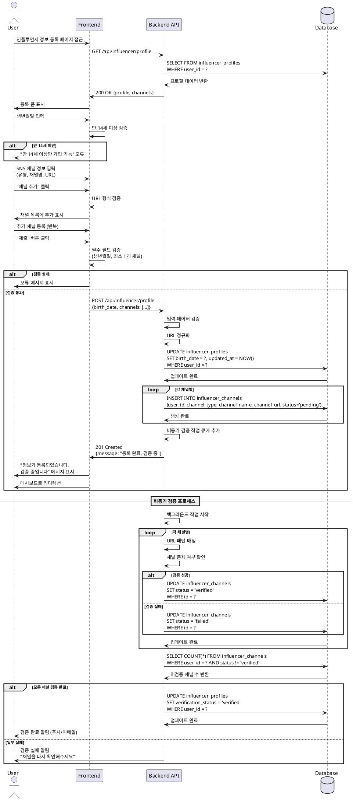

# UC-002: 인플루언서 정보 등록

## Primary Actor
- 인플루언서 (회원가입 완료, 이메일 검증 완료)

## Precondition
- 회원가입 및 이메일 검증이 완료된 상태
- 역할이 '인플루언서'로 설정된 상태
- `influencer_profiles` 레코드가 생성된 상태 (verification_status = 'pending')

## Trigger
- 회원가입 완료 후 인플루언서 정보 등록 페이지로 자동 리디렉션
- 또는 프로필 설정 메뉴에서 수동 접근

## Main Scenario

### 1. 정보 등록 페이지 접근
1. 사용자가 인플루언서 정보 등록 페이지에 접근한다
2. 시스템이 등록 폼을 표시한다:
   - 생년월일 입력 필드
   - SNS 채널 등록 섹션

### 2. 생년월일 입력
1. 사용자가 생년월일을 입력한다 (날짜 선택기)
2. 시스템이 나이를 자동 계산하여 표시한다
3. 시스템이 만 14세 이상 여부를 실시간 검증한다

### 3. SNS 채널 등록
1. 사용자가 "채널 추가" 버튼을 클릭한다
2. 시스템이 채널 입력 폼을 표시한다
3. 사용자가 채널 정보를 입력한다:
   - 채널 유형 선택 (Instagram, YouTube, Blog, TikTok 등)
   - 채널명
   - 채널 URL
4. 사용자가 "추가" 버튼을 클릭한다
5. 시스템이 채널 목록에 추가한다
6. 사용자는 여러 채널을 추가할 수 있다 (반복)

### 4. 채널 편집/삭제
1. 사용자가 등록된 채널의 "편집" 또는 "삭제" 버튼을 클릭한다
2. 편집: 채널 정보를 수정하고 저장한다
3. 삭제: 확인 다이얼로그 후 채널을 제거한다

### 5. 정보 제출
1. 사용자가 "제출" 또는 "임시저장" 버튼을 클릭한다
2. 시스템이 입력 데이터를 검증한다:
   - 생년월일: 만 14세 이상
   - 채널: 최소 1개 이상 등록
   - URL: 유효한 URL 형식
3. 시스템이 데이터를 저장한다:
   - `influencer_profiles` 업데이트 (birth_date)
   - `influencer_channels` 생성 (각 채널별)
4. 시스템이 비동기 검증 작업을 큐에 추가한다

### 6. 검증 프로세스
1. 백그라운드 작업이 각 채널을 검증한다:
   - URL 패턴 매칭
   - 채널 존재 여부 확인
   - 메트릭 수집 (선택사항)
2. 검증 완료 후 `influencer_channels.status` 업데이트 (verified/failed)
3. 모든 채널 검증 완료 시 `influencer_profiles.verification_status` 업데이트

### 7. 결과 확인
1. 사용자에게 "정보가 등록되었습니다. 검증 중입니다" 메시지 표시
2. 사용자를 대시보드 또는 홈으로 리디렉션
3. 검증 완료 시 알림 전송 (선택사항)

## Edge Cases

### 생년월일 미입력
- **발생 조건**: 생년월일을 입력하지 않고 제출
- **처리**: "생년월일을 입력해주세요" 오류 메시지 표시

### 만 14세 미만
- **발생 조건**: 입력한 생년월일이 만 14세 미만
- **처리**: "만 14세 이상만 가입 가능합니다" 오류 메시지 표시, 제출 불가

### 채널 미등록
- **발생 조건**: SNS 채널을 하나도 등록하지 않고 제출
- **처리**: "최소 1개 이상의 SNS 채널을 등록해주세요" 오류 메시지 표시

### 잘못된 URL 형식
- **발생 조건**: 유효하지 않은 URL 입력
- **처리**: "올바른 URL 형식이 아닙니다" 오류 메시지 표시

### 중복 채널 URL
- **발생 조건**: 이미 등록한 URL을 다시 추가 시도
- **처리**: "이미 등록된 채널입니다" 오류 메시지 표시

### 채널 유형 불일치
- **발생 조건**: Instagram URL인데 YouTube로 선택
- **처리**: "선택한 채널 유형과 URL이 일치하지 않습니다" 경고 메시지

### 채널 검증 실패
- **발생 조건**: 존재하지 않는 채널 또는 접근 불가
- **처리**: 채널 상태를 'failed'로 표시, "채널 검증에 실패했습니다. 다시 확인해주세요" 알림

### 임시저장 후 재접근
- **발생 조건**: 임시저장 후 나중에 다시 접근
- **처리**: 이전에 입력한 데이터 자동 로드, 이어서 작성 가능

### 네트워크 오류
- **발생 조건**: 제출 중 네트워크 오류 발생
- **처리**: "일시적인 오류가 발생했습니다. 다시 시도해주세요" 메시지, 입력 데이터 유지

## Business Rules

### BR-011: 나이 제한
- 만 14세 이상만 인플루언서 등록 가능
- 생년월일 기준으로 자동 계산

### BR-012: 채널 필수 등록
- 최소 1개 이상의 SNS 채널 등록 필수
- 최대 등록 채널 수 제한 없음

### BR-013: 지원 채널 유형
- Instagram, YouTube, Blog, TikTok, Facebook, Twitter
- 기타 채널은 '기타' 선택 후 직접 입력

### BR-014: URL 정규화
- URL은 자동으로 정규화 (http:// 또는 https:// 추가)
- 불필요한 쿼리 파라미터 제거

### BR-015: 중복 채널 방지
- 동일 사용자는 동일 URL을 중복 등록할 수 없음
- `influencer_channels(user_id, channel_url)` UNIQUE 제약

### BR-016: 검증 상태 관리
- 채널 등록 시 초기 상태: 'pending'
- 검증 완료 시: 'verified' 또는 'failed'
- 'failed' 상태 채널은 수정 후 재검증 가능

### BR-017: 프로필 검증 조건
- 모든 채널이 'verified' 상태일 때 프로필 검증 완료
- 하나라도 'pending' 또는 'failed'면 검증 미완료

### BR-018: 체험단 지원 가드
- `verification_status = 'verified'` 인플루언서만 체험단 지원 가능
- 미검증 상태에서는 체험단 지원 버튼 비활성화

### BR-019: 임시저장
- 언제든지 임시저장 가능
- 임시저장 데이터는 7일간 보관
- 제출 시 임시저장 데이터 자동 삭제

### BR-020: 수정 가능 시점
- 검증 완료 후에도 정보 수정 가능
- 수정 시 해당 채널 검증 상태 'pending'으로 초기화
- 재검증 프로세스 자동 시작

---

## Sequence Diagram

---

## Notes

### 구현 우선순위
1. **High**: 생년월일 및 기본 채널 등록
2. **High**: 채널 검증 상태 관리
3. **Medium**: 비동기 채널 검증 (URL 패턴 매칭)
4. **Medium**: 임시저장 기능
5. **Low**: 채널 메트릭 수집 (팔로워 수 등)
6. **Low**: 실시간 채널 검증

### 기술적 고려사항
- 채널 검증은 비동기 작업으로 처리 (응답 속도 개선)
- URL 정규화 로직 구현 (다양한 URL 형식 지원)
- 중복 채널 체크 (데이터베이스 레벨)
- 임시저장 데이터는 로컬스토리지 또는 DB 저장
- 검증 실패 시 재시도 로직

### UI/UX 고려사항
- 생년월일 날짜 선택기 (Datepicker)
- 채널 유형별 아이콘 표시
- 채널 목록 드래그 앤 드롭 정렬
- 검증 상태 실시간 표시 (pending/verified/failed)
- 검증 진행 상황 프로그레스바
- 채널별 검증 실패 사유 표시

