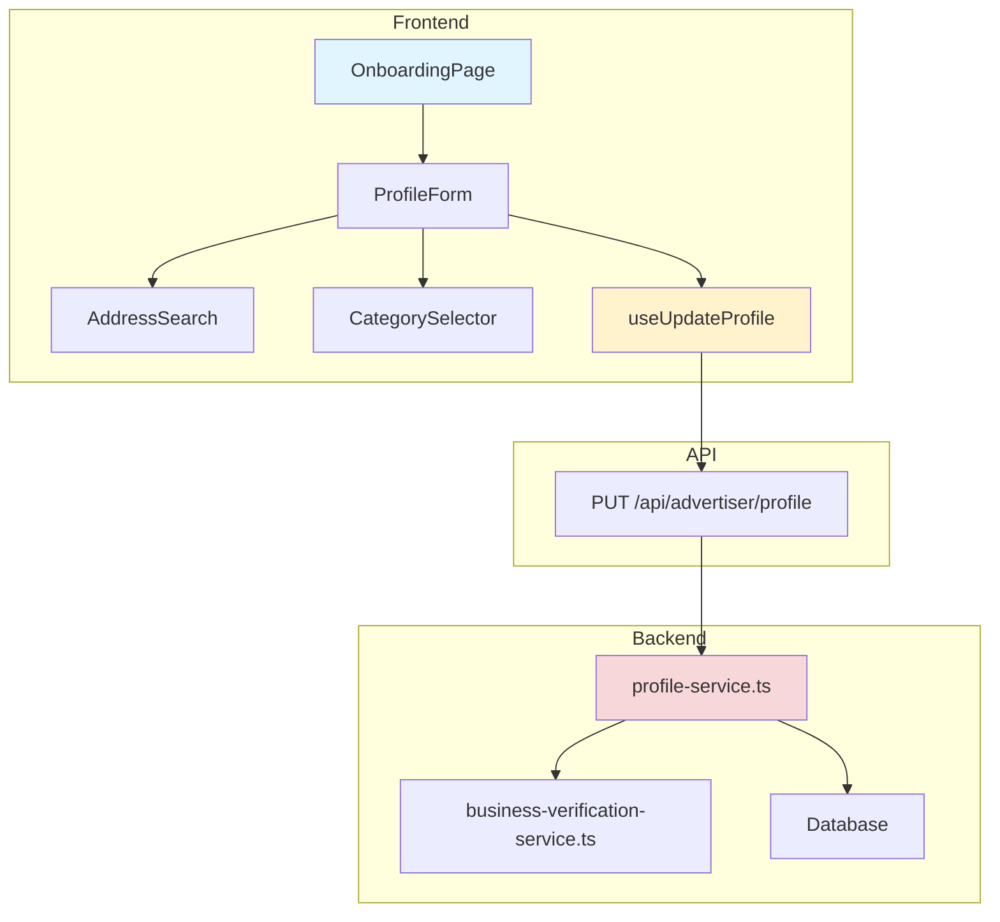

# UC-003: 광고주 정보 등록 - 구현 계획

## 개요

### 모듈 목록

| 모듈 | 위치 | 설명 |
|------|------|------|
| **Backend - API Routes** | `src/features/advertiser/backend/routes/profile.ts` | 광고주 프로필 CRUD API |
| **Backend - Services** | `src/features/advertiser/backend/services/profile-service.ts` | 프로필 등록/검증 로직 |
| **Backend - Services** | `src/features/advertiser/backend/services/business-verification-service.ts` | 사업자번호 검증 (비동기) |
| **Backend - Schema** | `src/features/advertiser/backend/schema/profile-schema.ts` | 프로필 스키마 (Zod) |
| **Backend - Error** | `src/features/advertiser/backend/errors/profile-error.ts` | 에러 코드 정의 |
| **Frontend - Pages** | `src/app/advertiser/onboarding/page.tsx` | 광고주 온보딩 페이지 |
| **Frontend - Components** | `src/features/advertiser/components/ProfileForm.tsx` | 프로필 입력 폼 |
| **Frontend - Components** | `src/features/advertiser/components/AddressSearch.tsx` | 주소 검색 컴포넌트 |
| **Frontend - Components** | `src/features/advertiser/components/CategorySelector.tsx` | 카테고리 선택 |
| **Frontend - Hooks** | `src/features/advertiser/hooks/useUpdateProfile.ts` | 프로필 업데이트 훅 |
| **Shared - Utils** | `src/lib/utils/business-number-utils.ts` | 사업자번호 검증 유틸 |

---

## Diagram



---

## Implementation Plan

### 1. Backend - Schema

```typescript
// src/features/advertiser/backend/schema/profile-schema.ts
import { z } from 'zod';

// 사업자등록번호 검증 (10자리)
const businessNumberSchema = z.string()
  .regex(/^\d{10}$/, '사업자등록번호는 10자리 숫자입니다')
  .refine((value) => {
    // 체크섬 알고리즘 검증
    const weights = [1, 3, 7, 1, 3, 7, 1, 3, 5];
    const nums = value.split('').map(Number);
    let sum = 0;
    
    for (let i = 0; i < 9; i++) {
      sum += nums[i] * weights[i];
    }
    
    sum += Math.floor((nums[8] * 5) / 10);
    const checkDigit = (10 - (sum % 10)) % 10;
    
    return checkDigit === nums[9];
  }, '유효하지 않은 사업자등록번호입니다');

export const UpdateAdvertiserProfileSchema = z.object({
  businessName: z.string().min(2, '업체명을 2자 이상 입력해주세요').max(255),
  location: z.string().min(5, '위치를 입력해주세요'),
  category: z.enum([
    'restaurant',
    'cafe',
    'beauty',
    'fashion',
    'entertainment',
    'other'
  ]),
  businessRegistrationNumber: businessNumberSchema,
});

export type UpdateAdvertiserProfileRequest = z.infer<typeof UpdateAdvertiserProfileSchema>;
```

**Unit Tests:**
```typescript
describe('BusinessNumberSchema', () => {
  it('should validate correct business number', () => {
    expect(businessNumberSchema.parse('1234567890')).toBe('1234567890');
  });

  it('should reject invalid format', () => {
    expect(() => businessNumberSchema.parse('123')).toThrow();
  });

  it('should reject invalid checksum', () => {
    expect(() => businessNumberSchema.parse('1234567899')).toThrow();
  });
});
```

---

### 2. Backend - Service

```typescript
// src/features/advertiser/backend/services/profile-service.ts
export const updateAdvertiserProfile = async (
  client: SupabaseClient,
  userId: string,
  request: UpdateAdvertiserProfileRequest
): Promise<HandlerResult<ProfileResponse, ProfileServiceError, unknown>> => {
  try {
    // 1. 사업자번호 중복 체크
    const { data: existing } = await client
      .from('advertiser_profiles')
      .select('user_id')
      .eq('business_registration_number', request.businessRegistrationNumber)
      .neq('user_id', userId)
      .maybeSingle();

    if (existing) {
      return failure(400, profileErrorCodes.businessNumberExists, 
        '이미 등록된 사업자등록번호입니다');
    }

    // 2. 프로필 업데이트
    const { error } = await client
      .from('advertiser_profiles')
      .update({
        business_name: request.businessName,
        location: request.location,
        category: request.category,
        business_registration_number: request.businessRegistrationNumber,
        verification_status: 'pending',
      })
      .eq('user_id', userId);

    if (error) {
      return failure(500, profileErrorCodes.updateFailed, '프로필 업데이트 실패', error);
    }

    // 3. 검증 작업 큐 추가
    // await addToBusinessVerificationQueue(userId, request.businessRegistrationNumber);

    return success({ success: true });
  } catch (error) {
    return failure(500, profileErrorCodes.internalError, '오류 발생', error);
  }
};
```

---

### 3. Frontend - Component

```typescript
// src/features/advertiser/components/ProfileForm.tsx
export const ProfileForm = () => {
  const updateProfile = useUpdateProfile();
  
  const form = useForm<UpdateAdvertiserProfileRequest>({
    resolver: zodResolver(UpdateAdvertiserProfileSchema),
  });

  return (
    <Form {...form}>
      <form onSubmit={form.handleSubmit(updateProfile.mutateAsync)}>
        <FormField name="businessName" label="업체명" />
        <FormField name="location" render={() => <AddressSearch />} />
        <FormField name="category" render={() => <CategorySelector />} />
        <FormField name="businessRegistrationNumber" label="사업자등록번호" />
        <Button type="submit">등록</Button>
      </form>
    </Form>
  );
};
```

**QA Sheet:**
```markdown
- [ ] 사업자번호 자동 하이픈 추가되는가?
- [ ] 주소 검색 정상 작동하는가?
- [ ] 카테고리 선택 UI 명확한가?
- [ ] 중복 사업자번호 에러 표시되는가?
```

---

## Summary

### 구현 순서
1. Schema & Error
2. Business Number Utils
3. Backend Services
4. API Routes
5. Frontend Components
6. Integration & Testing

### 테스트 체크리스트
- [ ] 사업자번호 체크섬 검증
- [ ] 중복 검증
- [ ] 주소 검색 연동

