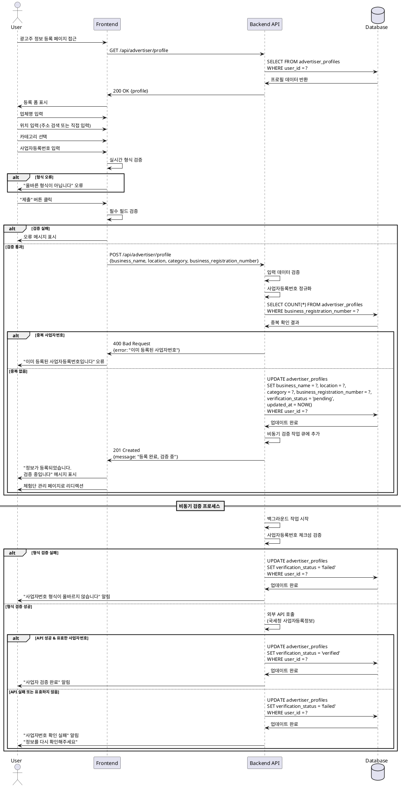

# UC-003: 광고주 정보 등록

## Primary Actor
- 광고주 (회원가입 완료, 이메일 검증 완료)

## Precondition
- 회원가입 및 이메일 검증이 완료된 상태
- 역할이 '광고주'로 설정된 상태
- `advertiser_profiles` 레코드가 생성된 상태 (verification_status = 'pending')

## Trigger
- 회원가입 완료 후 광고주 정보 등록 페이지로 자동 리디렉션
- 또는 프로필 설정 메뉴에서 수동 접근

## Main Scenario

### 1. 정보 등록 페이지 접근
1. 사용자가 광고주 정보 등록 페이지에 접근한다
2. 시스템이 등록 폼을 표시한다:
   - 업체명
   - 위치 (주소)
   - 카테고리
   - 사업자등록번호

### 2. 업체 정보 입력
1. 사용자가 업체명을 입력한다
2. 사용자가 위치를 입력한다:
   - 주소 검색 API 활용 (선택사항)
   - 또는 직접 입력
3. 사용자가 카테고리를 선택한다:
   - 음식점, 카페, 뷰티, 패션, 엔터테인먼트, 기타 등
4. 사용자가 사업자등록번호를 입력한다 (10자리 숫자)

### 3. 데이터 검증
1. 시스템이 입력 필드를 실시간 검증한다:
   - 업체명: 2-255자
   - 위치: 필수 입력
   - 사업자등록번호: 10자리 숫자, 형식 검증
2. 시스템이 사업자등록번호 중복을 확인한다

### 4. 정보 제출
1. 사용자가 "제출" 또는 "임시저장" 버튼을 클릭한다
2. 시스템이 최종 검증을 수행한다
3. 시스템이 데이터를 저장한다:
   - `advertiser_profiles` 업데이트
   - 필드 정규화 (공백 제거, 하이픈 정규화 등)
4. 시스템이 비동기 검증 작업을 큐에 추가한다

### 5. 사업자번호 검증 프로세스
1. 백그라운드 작업이 사업자등록번호를 검증한다:
   - 형식 검증 (체크섬 알고리즘)
   - 외부 API 연동 (국세청 사업자등록정보 확인)
2. 검증 완료 후 `advertiser_profiles.verification_status` 업데이트 (verified/failed)

### 6. 결과 확인
1. 사용자에게 "정보가 등록되었습니다. 검증 중입니다" 메시지 표시
2. 사용자를 체험단 관리 페이지로 리디렉션
3. 검증 완료 시 알림 전송

## Edge Cases

### 업체명 미입력
- **발생 조건**: 업체명을 입력하지 않고 제출
- **처리**: "업체명을 입력해주세요" 오류 메시지 표시

### 위치 미입력
- **발생 조건**: 위치를 입력하지 않고 제출
- **처리**: "업체 위치를 입력해주세요" 오류 메시지 표시

### 카테고리 미선택
- **발생 조건**: 카테고리를 선택하지 않고 제출
- **처리**: "카테고리를 선택해주세요" 오류 메시지 표시

### 사업자등록번호 형식 오류
- **발생 조건**: 10자리 숫자가 아니거나 유효하지 않은 형식
- **처리**: "올바른 사업자등록번호 형식이 아닙니다" 오류 메시지 표시

### 사업자등록번호 중복
- **발생 조건**: 이미 등록된 사업자등록번호로 시도
- **처리**: "이미 등록된 사업자등록번호입니다" 오류 메시지 표시, 제출 불가

### 사업자번호 검증 실패
- **발생 조건**: 존재하지 않는 사업자번호 또는 폐업 등
- **처리**: "사업자등록번호 확인에 실패했습니다. 다시 확인해주세요" 알림, verification_status = 'failed'

### 외부 API 오류
- **발생 조건**: 국세청 API 장애 또는 타임아웃
- **처리**: 검증 재시도 스케줄링, 사용자에게 "검증이 지연되고 있습니다" 안내

### 임시저장 후 재접근
- **발생 조건**: 임시저장 후 나중에 다시 접근
- **처리**: 이전에 입력한 데이터 자동 로드

### 레이트 리밋 초과
- **발생 조건**: 짧은 시간 내 반복적인 제출 시도
- **처리**: "잠시 후 다시 시도해주세요" 메시지 표시

## Business Rules

### BR-021: 업체명 정책
- 2자 이상, 255자 이하
- 특수문자 허용 (괄호, 하이픈 등)

### BR-022: 위치 필수
- 업체 위치는 필수 입력 항목
- 상세 주소까지 입력 권장

### BR-023: 카테고리 선택 필수
- 사전 정의된 카테고리 중 선택
- 기타 선택 시 상세 설명 입력 가능

### BR-024: 사업자등록번호 형식
- 10자리 숫자 (하이픈 자동 제거)
- 체크섬 알고리즘으로 유효성 검증
- 형식: XXX-XX-XXXXX

### BR-025: 사업자등록번호 유일성
- 하나의 사업자등록번호는 하나의 계정에만 등록 가능
- 중복 등록 시도는 차단됨
- `advertiser_profiles.business_registration_number` UNIQUE 제약

### BR-026: 검증 상태 관리
- 등록 시 초기 상태: 'pending'
- 검증 완료 시: 'verified' 또는 'failed'
- 'failed' 상태에서는 정보 수정 후 재검증 가능

### BR-027: 체험단 등록 가드
- `verification_status = 'verified'` 광고주만 체험단 등록 가능
- 미검증 상태에서는 체험단 등록 버튼 비활성화

### BR-028: 사업자번호 검증 재시도
- 검증 실패 시 24시간 내 최대 3회 재검증 시도
- 3회 실패 시 관리자 검토 필요

### BR-029: 임시저장
- 언제든지 임시저장 가능
- 임시저장 데이터는 7일간 보관
- 제출 시 임시저장 데이터 자동 삭제

### BR-030: 정보 수정
- 검증 완료 후에도 정보 수정 가능 (사업자등록번호 제외)
- 사업자등록번호 변경 시 관리자 승인 필요
- 수정 시 재검증 프로세스 자동 시작

---

## Sequence Diagram

---

## Notes

### 구현 우선순위
1. **High**: 기본 정보 입력 및 저장
2. **High**: 사업자등록번호 형식 검증
3. **Medium**: 외부 API 연동 (국세청)
4. **Medium**: 주소 검색 API 연동
5. **Low**: 임시저장 기능
6. **Low**: 사업자등록증 파일 업로드

### 기술적 고려사항
- 사업자등록번호 체크섬 알고리즘 구현
- 국세청 API 연동 (타임아웃, 재시도 로직)
- 주소 검색 API 연동 (카카오/네이버)
- 중복 체크 (데이터베이스 레벨)
- 검증 실패 시 재시도 스케줄링
- 레이트 리밋 적용

### UI/UX 고려사항
- 사업자등록번호 자동 하이픈 추가 (XXX-XX-XXXXX)
- 주소 검색 자동완성
- 카테고리 아이콘 표시
- 검증 상태 실시간 표시 (pending/verified/failed)
- 검증 실패 시 수정 가이드 제공
- 사업자등록증 샘플 이미지 제공

