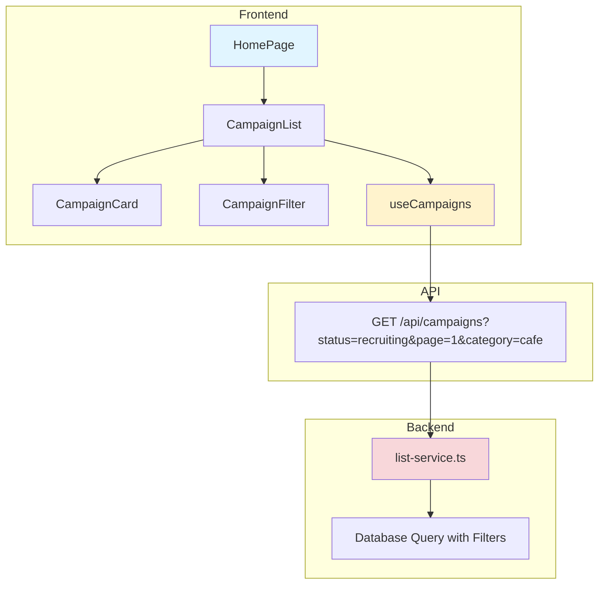

# UC-004: 홈 & 체험단 목록 탐색 - 구현 계획

## 개요

### 모듈 목록

| 모듈 | 위치 | 설명 |
|------|------|------|
| **Backend - API Routes** | `src/features/campaign/backend/routes/list.ts` | 체험단 목록 조회 API |
| **Backend - Services** | `src/features/campaign/backend/services/list-service.ts` | 목록 조회/필터링 로직 |
| **Backend - Schema** | `src/features/campaign/backend/schema/list-schema.ts` | 목록 요청/응답 스키마 |
| **Frontend - Pages** | `src/app/page.tsx` | 홈 페이지 (루트) |
| **Frontend - Components** | `src/features/campaign/components/CampaignList.tsx` | 체험단 목록 컴포넌트 |
| **Frontend - Components** | `src/features/campaign/components/CampaignCard.tsx` | 체험단 카드 |
| **Frontend - Components** | `src/features/campaign/components/CampaignFilter.tsx` | 필터 UI |
| **Frontend - Hooks** | `src/features/campaign/hooks/useCampaigns.ts` | 목록 조회 훅 |
| **Shared - Types** | `src/features/campaign/types/campaign-types.ts` | 공통 타입 |

---

## Diagram



---

## Implementation Plan

### 1. Backend - Schema

```typescript
// src/features/campaign/backend/schema/list-schema.ts
export const CampaignListQuerySchema = z.object({
  status: z.enum(['recruiting', 'closed', 'selection_completed']).optional(),
  category: z.string().optional(),
  location: z.string().optional(),
  page: z.coerce.number().int().min(1).default(1),
  limit: z.coerce.number().int().min(1).max(100).default(20),
  sort: z.enum(['latest', 'deadline', 'popular']).default('latest'),
});

export const CampaignListResponseSchema = z.object({
  campaigns: z.array(CampaignCardSchema),
  total: z.number(),
  page: z.number(),
  hasMore: z.boolean(),
});

const CampaignCardSchema = z.object({
  id: z.string().uuid(),
  title: z.string(),
  businessName: z.string(),
  category: z.string(),
  location: z.string(),
  recruitmentEndDate: z.string(),
  totalSlots: z.number(),
  applicantCount: z.number(),
  daysLeft: z.number(),
  thumbnailUrl: z.string().nullable(),
});
```

---

### 2. Backend - Service

```typescript
// src/features/campaign/backend/services/list-service.ts
export const getCampaigns = async (
  client: SupabaseClient,
  query: CampaignListQuery
): Promise<HandlerResult<CampaignListResponse, ServiceError, unknown>> => {
  try {
    let queryBuilder = client
      .from('campaigns')
      .select(`
        *,
        advertiser:advertiser_profiles(business_name, category, location),
        applicant_count:campaign_applications(count)
      `, { count: 'exact' })
      .eq('status', query.status || 'recruiting')
      .gte('recruitment_end_date', new Date().toISOString());

    // 필터 적용
    if (query.category) {
      queryBuilder = queryBuilder.eq('advertiser.category', query.category);
    }
    if (query.location) {
      queryBuilder = queryBuilder.ilike('location', `%${query.location}%`);
    }

    // 정렬
    switch (query.sort) {
      case 'deadline':
        queryBuilder = queryBuilder.order('recruitment_end_date', { ascending: true });
        break;
      case 'popular':
        queryBuilder = queryBuilder.order('applicant_count', { ascending: false });
        break;
      default:
        queryBuilder = queryBuilder.order('created_at', { ascending: false });
    }

    // 페이지네이션
    const offset = (query.page - 1) * query.limit;
    queryBuilder = queryBuilder.range(offset, offset + query.limit - 1);

    const { data, error, count } = await queryBuilder;

    if (error) {
      return failure(500, 'FETCH_ERROR', '목록 조회 실패', error);
    }

    // D-day 계산
    const campaigns = data.map(c => ({
      ...c,
      daysLeft: calculateDaysLeft(c.recruitment_end_date),
    }));

    return success({
      campaigns,
      total: count || 0,
      page: query.page,
      hasMore: (count || 0) > offset + query.limit,
    });
  } catch (error) {
    return failure(500, 'INTERNAL_ERROR', '오류 발생', error);
  }
};
```

**Unit Tests:**
```typescript
describe('getCampaigns', () => {
  it('should return recruiting campaigns', async () => {
    const result = await getCampaigns(mockClient, { status: 'recruiting' });
    expect(result.ok).toBe(true);
  });

  it('should apply category filter', async () => {
    const result = await getCampaigns(mockClient, { category: 'cafe' });
    expect(mockClient.from).toHaveBeenCalledWith(expect.stringContaining('cafe'));
  });

  it('should calculate D-day correctly', () => {
    const daysLeft = calculateDaysLeft(tomorrow);
    expect(daysLeft).toBe(1);
  });
});
```

---

### 3. Frontend - Component

```typescript
// src/features/campaign/components/CampaignList.tsx
export const CampaignList = () => {
  const [filters, setFilters] = useState({ category: '', location: '' });
  const { data, isLoading, fetchNextPage, hasNextPage } = useCampaigns(filters);

  if (isLoading) return <CampaignListSkeleton />;
  if (!data?.pages[0]?.campaigns.length) return <EmptyState />;

  return (
    <div>
      <CampaignFilter value={filters} onChange={setFilters} />
      
      <div className="grid grid-cols-1 md:grid-cols-2 lg:grid-cols-3 gap-4">
        {data.pages.flatMap(page => page.campaigns).map(campaign => (
          <CampaignCard key={campaign.id} campaign={campaign} />
        ))}
      </div>

      {hasNextPage && (
        <Button onClick={() => fetchNextPage()}>더보기</Button>
      )}
    </div>
  );
};
```

**QA Sheet:**
```markdown
- [ ] 스켈레톤 UI 표시되는가?
- [ ] 필터 변경 시 목록 갱신되는가?
- [ ] 무한 스크롤/더보기 정상 작동하는가?
- [ ] D-day 강조 표시되는가?
- [ ] 빈 상태 UI 표시되는가?
```

---

## Summary

### 구현 순서
1. Schema (Query & Response)
2. Backend Service (Filtering, Sorting, Pagination)
3. API Routes
4. Frontend Hooks (React Query Infinite Query)
5. UI Components (List, Card, Filter)

### 테스트 체크리스트
- [ ] 필터링 로직
- [ ] 정렬 옵션
- [ ] 페이지네이션
- [ ] D-day 계산
- [ ] 무한 스크롤

