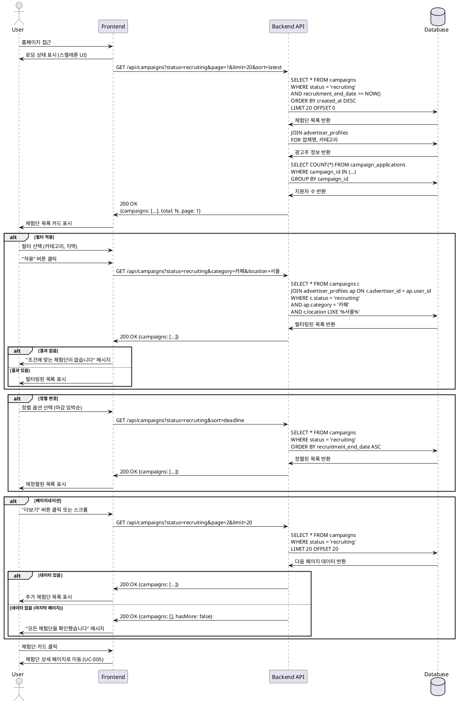

# UC-004: 홈 & 체험단 목록 탐색

## Primary Actor
- 모든 사용자 (인플루언서, 광고주, 비로그인 사용자)

## Precondition
- 서비스에 접속 가능한 상태
- (인플루언서의 경우) 체험단 지원을 위해서는 검증 완료 필요

## Trigger
- 사용자가 홈페이지 접근
- 사용자가 체험단 목록 메뉴 클릭

## Main Scenario

### 1. 홈 페이지 접근
1. 사용자가 홈페이지에 접근한다
2. 시스템이 기본 레이아웃을 표시한다:
   - 헤더 (로고, 메뉴, 로그인/프로필)
   - 배너 섹션 (선택사항)
   - 체험단 목록 섹션
   - 필터 및 정렬 옵션

### 2. 체험단 목록 조회
1. 시스템이 모집 중인 체험단 목록을 조회한다:
   - `status = 'recruiting'`
   - `recruitment_end_date >= NOW()`
2. 시스템이 기본 정렬로 목록을 표시한다 (최신순)
3. 각 체험단 카드에 다음 정보를 표시한다:
   - 체험단 제목
   - 업체명 및 카테고리
   - 위치
   - 모집 기간 (D-day 표시)
   - 모집 인원 (현재 지원자 수 / 총 모집 인원)
   - 썸네일 이미지 (선택사항)

### 3. 필터 적용
1. 사용자가 필터 옵션을 선택한다:
   - 카테고리 (음식점, 카페, 뷰티 등)
   - 지역 (서울, 경기, 부산 등)
   - 모집 상태 (모집 중만 표시)
2. 사용자가 "적용" 버튼을 클릭한다
3. 시스템이 필터 조건에 맞는 체험단을 조회한다
4. 시스템이 필터링된 목록을 표시한다

### 4. 정렬 변경
1. 사용자가 정렬 옵션을 선택한다:
   - 최신순 (기본)
   - 마감 임박순
   - 인기순 (지원자 수 기준)
2. 시스템이 선택한 기준으로 목록을 재정렬하여 표시한다

### 5. 페이지네이션
1. 시스템이 한 페이지에 20개의 체험단을 표시한다
2. 사용자가 "더보기" 버튼을 클릭하거나 페이지 번호를 선택한다
3. 시스템이 다음 페이지의 체험단을 로드하여 표시한다

### 6. 체험단 상세 이동
1. 사용자가 체험단 카드를 클릭한다
2. 시스템이 체험단 상세 페이지로 이동한다 (UC-005)

## Edge Cases

### 모집 중인 체험단 없음
- **발생 조건**: 조회 결과가 0건
- **처리**: "현재 모집 중인 체험단이 없습니다" 메시지 및 안내 표시

### 필터 결과 없음
- **발생 조건**: 필터 적용 후 조회 결과가 0건
- **처리**: "조건에 맞는 체험단이 없습니다. 필터를 변경해보세요" 메시지

### 네트워크 오류
- **발생 조건**: 목록 조회 중 네트워크 오류
- **처리**: "일시적인 오류가 발생했습니다" 메시지, 재시도 버튼 제공

### 로딩 시간 지연
- **발생 조건**: 대용량 데이터 또는 느린 네트워크
- **처리**: 스켈레톤 UI 또는 로딩 스피너 표시

### 페이지네이션 끝
- **발생 조건**: 마지막 페이지 도달
- **처리**: "더보기" 버튼 비활성화 또는 제거, "모든 체험단을 확인했습니다" 메시지

### 비로그인 사용자 접근
- **발생 조건**: 로그인하지 않은 상태로 목록 조회
- **처리**: 목록은 정상 표시, 지원 시 로그인 요구

### 캐시 데이터 사용
- **발생 조건**: 빠른 재접근 시
- **처리**: 캐시된 데이터 표시 후 백그라운드에서 최신 데이터 갱신

## Business Rules

### BR-031: 모집 중 체험단 표시
- `status = 'recruiting'` 이고 `recruitment_end_date >= NOW()` 인 체험단만 표시
- 모집 종료된 체험단은 목록에서 자동 제외

### BR-032: 기본 정렬
- 최신 등록순 (created_at DESC)
- 사용자가 변경하지 않는 한 기본 정렬 유지

### BR-033: 페이지네이션
- 한 페이지당 20개 체험단 표시
- 무한 스크롤 또는 페이지 번호 방식 선택 가능

### BR-034: 필터 조건 유지
- 필터 및 정렬 조건은 세션 동안 유지
- 페이지 이동 후 돌아와도 이전 조건 유지

### BR-035: 카테고리 필터
- 광고주 프로필의 카테고리 기준으로 필터링
- 다중 선택 가능

### BR-036: 지역 필터
- 체험단 위치(location) 기준으로 필터링
- 키워드 매칭 방식

### BR-037: D-day 계산
- 모집 종료일 기준으로 D-day 자동 계산
- D-day 0: 오늘 마감
- D-day 음수: 마감됨 (표시 안 함)

### BR-038: 지원자 수 표시
- 실시간 지원자 수 / 총 모집 인원 표시
- 모집 완료 시 "모집 완료" 배지 표시

### BR-039: 접근 권한
- 목록 조회는 모든 사용자 가능 (비로그인 포함)
- 체험단 상세 조회는 로그인 필요
- 체험단 지원은 검증 완료된 인플루언서만 가능

### BR-040: 데이터 캐싱
- 목록 데이터는 1분간 캐싱
- 실시간 업데이트가 중요하지 않은 정보만 캐싱
- 지원자 수는 캐싱하지 않음 (또는 짧은 TTL)

---

## Sequence Diagram

---

## Notes

### 구현 우선순위
1. **High**: 기본 목록 조회 및 표시
2. **High**: 페이지네이션
3. **Medium**: 필터 기능 (카테고리, 지역)
4. **Medium**: 정렬 기능
5. **Low**: 검색 기능
6. **Low**: 배너 섹션

### 기술적 고려사항
- 목록 조회 성능 최적화 (인덱스 활용)
- 페이지네이션: offset 방식 또는 cursor 방식
- 캐싱 전략 (Redis)
- 이미지 최적화 (썸네일, Lazy Loading)
- 무한 스크롤 시 메모리 관리
- 실시간 데이터 갱신 (WebSocket 또는 Polling)

### UI/UX 고려사항
- 스켈레톤 UI로 로딩 상태 표시
- 체험단 카드 디자인 (이미지, 정보 배치)
- 필터 UI (사이드바 또는 상단 필터 바)
- 정렬 드롭다운
- D-day 강조 표시 (색상, 배지)
- 모집 완료 체험단 시각적 구분
- 반응형 디자인 (모바일 최적화)
- 빈 상태(Empty State) 디자인

