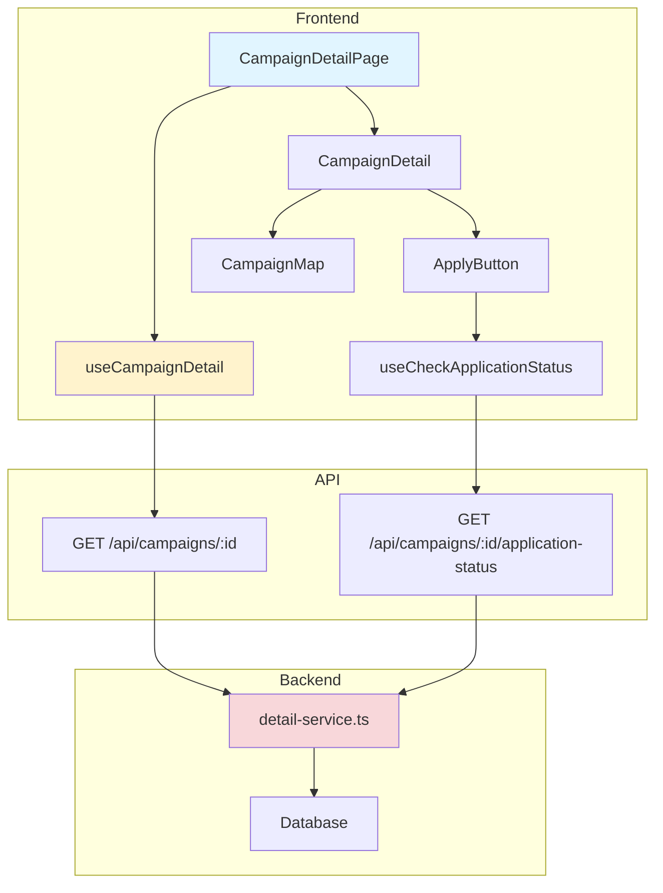

# UC-005: 체험단 상세 - 구현 계획

## 개요

### 모듈 목록

| 모듈 | 위치 | 설명 |
|------|------|------|
| **Backend - API Routes** | `src/features/campaign/backend/routes/detail.ts` | 체험단 상세 조회 API |
| **Backend - Services** | `src/features/campaign/backend/services/detail-service.ts` | 상세 조회 로직 |
| **Backend - Schema** | `src/features/campaign/backend/schema/detail-schema.ts` | 상세 응답 스키마 |
| **Frontend - Pages** | `src/app/campaigns/[id]/page.tsx` | 체험단 상세 페이지 |
| **Frontend - Components** | `src/features/campaign/components/CampaignDetail.tsx` | 상세 정보 컴포넌트 |
| **Frontend - Components** | `src/features/campaign/components/ApplyButton.tsx` | 지원 버튼 |
| **Frontend - Components** | `src/features/campaign/components/CampaignMap.tsx` | 지도 표시 (선택) |
| **Frontend - Hooks** | `src/features/campaign/hooks/useCampaignDetail.ts` | 상세 조회 훅 |
| **Frontend - Hooks** | `src/features/campaign/hooks/useCheckApplicationStatus.ts` | 지원 상태 확인 훅 |

---

## Diagram



---

## Implementation Plan

### 1. Backend - Schema

```typescript
// src/features/campaign/backend/schema/detail-schema.ts
export const CampaignDetailResponseSchema = z.object({
  id: z.string().uuid(),
  title: z.string(),
  description: z.string(),
  benefits: z.string(),
  mission: z.string(),
  location: z.string(),
  recruitmentStartDate: z.string(),
  recruitmentEndDate: z.string(),
  experienceStartDate: z.string(),
  experienceEndDate: z.string(),
  totalSlots: z.number(),
  selectedCount: z.number(),
  applicantCount: z.number(),
  status: z.enum(['recruiting', 'closed', 'selection_completed']),
  daysLeft: z.number(),
  
  advertiser: z.object({
    businessName: z.string(),
    category: z.string(),
    location: z.string(),
  }),
  
  userApplicationStatus: z.enum(['not_applied', 'pending', 'selected', 'rejected']).nullable(),
});

export type CampaignDetailResponse = z.infer<typeof CampaignDetailResponseSchema>;
```

---

### 2. Backend - Service

```typescript
// src/features/campaign/backend/services/detail-service.ts
export const getCampaignDetail = async (
  client: SupabaseClient,
  campaignId: string,
  userId?: string
): Promise<HandlerResult<CampaignDetailResponse, ServiceError, unknown>> => {
  try {
    // 1. 캠페인 조회
    const { data: campaign, error } = await client
      .from('campaigns')
      .select(`
        *,
        advertiser:advertiser_profiles!inner(business_name, category, location),
        applications:campaign_applications(count)
      `)
      .eq('id', campaignId)
      .single();

    if (error || !campaign) {
      return failure(404, 'NOT_FOUND', '체험단을 찾을 수 없습니다');
    }

    // 2. 사용자 지원 상태 조회 (로그인한 경우)
    let userApplicationStatus = null;
    if (userId) {
      const { data: application } = await client
        .from('campaign_applications')
        .select('status')
        .eq('campaign_id', campaignId)
        .eq('user_id', userId)
        .maybeSingle();

      userApplicationStatus = application ? application.status : 'not_applied';
    }

    // 3. 응답 구성
    return success<CampaignDetailResponse>({
      id: campaign.id,
      title: campaign.title,
      description: campaign.description,
      benefits: campaign.benefits,
      mission: campaign.mission,
      location: campaign.location,
      recruitmentStartDate: campaign.recruitment_start_date,
      recruitmentEndDate: campaign.recruitment_end_date,
      experienceStartDate: campaign.experience_start_date,
      experienceEndDate: campaign.experience_end_date,
      totalSlots: campaign.total_slots,
      selectedCount: campaign.selected_count,
      applicantCount: campaign.applications[0]?.count || 0,
      status: campaign.status,
      daysLeft: calculateDaysLeft(campaign.recruitment_end_date),
      advertiser: campaign.advertiser,
      userApplicationStatus,
    });

  } catch (error) {
    return failure(500, 'INTERNAL_ERROR', '오류 발생', error);
  }
};
```

**Unit Tests:**
```typescript
describe('getCampaignDetail', () => {
  it('should return campaign detail', async () => {
    const result = await getCampaignDetail(mockClient, 'campaign-id');
    expect(result.ok).toBe(true);
    if (result.ok) {
      expect(result.data.title).toBeDefined();
    }
  });

  it('should return 404 for non-existent campaign', async () => {
    const result = await getCampaignDetail(mockClient, 'invalid-id');
    expect(result.ok).toBe(false);
    if (!result.ok) {
      expect(result.error.code).toBe('NOT_FOUND');
    }
  });

  it('should include user application status when logged in', async () => {
    const result = await getCampaignDetail(mockClient, 'campaign-id', 'user-id');
    expect(result.ok).toBe(true);
    if (result.ok) {
      expect(result.data.userApplicationStatus).toBeDefined();
    }
  });
});
```

---

### 3. Frontend - Page

```typescript
// src/app/campaigns/[id]/page.tsx
import { CampaignDetail } from '@/features/campaign/components/CampaignDetail';

export default async function CampaignDetailPage({ 
  params 
}: { 
  params: { id: string } 
}) {
  return (
    <div className="container mx-auto py-8">
      <CampaignDetail campaignId={params.id} />
    </div>
  );
}
```

---

### 4. Frontend - Component

```typescript
// src/features/campaign/components/CampaignDetail.tsx
export const CampaignDetail = ({ campaignId }: { campaignId: string }) => {
  const { data: campaign, isLoading } = useCampaignDetail(campaignId);
  const { data: currentUser } = useCurrentUser();

  if (isLoading) return <DetailSkeleton />;
  if (!campaign) return <NotFound />;

  const canApply = campaign.status === 'recruiting' 
    && campaign.userApplicationStatus === 'not_applied'
    && currentUser?.role === 'influencer';

  return (
    <div className="space-y-6">
      {/* 헤더 */}
      <div className="flex justify-between items-start">
        <div>
          <h1 className="text-3xl font-bold">{campaign.title}</h1>
          <p className="text-gray-600">{campaign.advertiser.businessName}</p>
        </div>
        <Badge variant={campaign.status === 'recruiting' ? 'success' : 'secondary'}>
          D-{campaign.daysLeft}
        </Badge>
      </div>

      {/* 주요 정보 */}
      <Card>
        <CardContent>
          <dl className="grid grid-cols-2 gap-4">
            <div>
              <dt className="font-semibold">카테고리</dt>
              <dd>{campaign.advertiser.category}</dd>
            </div>
            <div>
              <dt className="font-semibold">위치</dt>
              <dd>{campaign.location}</dd>
            </div>
            <div>
              <dt className="font-semibold">모집 인원</dt>
              <dd>{campaign.selectedCount} / {campaign.totalSlots}명</dd>
            </div>
            <div>
              <dt className="font-semibold">신청자</dt>
              <dd>{campaign.applicantCount}명</dd>
            </div>
          </dl>
        </CardContent>
      </Card>

      {/* 상세 설명 */}
      <Card>
        <CardHeader>
          <CardTitle>상세 설명</CardTitle>
        </CardHeader>
        <CardContent>
          <p className="whitespace-pre-wrap">{campaign.description}</p>
        </CardContent>
      </Card>

      {/* 제공 혜택 */}
      <Card>
        <CardHeader>
          <CardTitle>제공 혜택</CardTitle>
        </CardHeader>
        <CardContent>
          <p className="whitespace-pre-wrap">{campaign.benefits}</p>
        </CardContent>
      </Card>

      {/* 미션 */}
      <Card>
        <CardHeader>
          <CardTitle>미션</CardTitle>
        </CardHeader>
        <CardContent>
          <p className="whitespace-pre-wrap">{campaign.mission}</p>
        </CardContent>
      </Card>

      {/* 지도 (선택) */}
      <CampaignMap location={campaign.location} />

      {/* 지원 버튼 */}
      {canApply && (
        <ApplyButton campaignId={campaign.id} />
      )}

      {campaign.userApplicationStatus === 'pending' && (
        <Alert>
          <AlertDescription>이미 지원한 체험단입니다.</AlertDescription>
        </Alert>
      )}

      {campaign.userApplicationStatus === 'selected' && (
        <Alert variant="success">
          <AlertDescription>선정되었습니다!</AlertDescription>
        </Alert>
      )}
    </div>
  );
};
```

**QA Sheet:**
```markdown
## Visual Tests
- [ ] 타이틀/업체명 명확히 표시되는가?
- [ ] D-day 뱃지가 눈에 띄는가?
- [ ] 정보 카드가 읽기 쉽게 배치되는가?
- [ ] 긴 텍스트가 줄바꿈되는가?

## Functional Tests
- [ ] 존재하지 않는 ID 접근 시 404 표시되는가?
- [ ] 로그인 상태에 따라 버튼이 변경되는가?
- [ ] 지원 상태에 따라 UI가 변경되는가?
- [ ] 모집 마감 시 지원 버튼이 비활성화되는가?

## Responsive Tests
- [ ] 모바일에서 레이아웃이 깨지지 않는가?
- [ ] 긴 텍스트가 모바일에서 잘 표시되는가?
```

---

## Summary

### 구현 순서
1. Schema (Detail Response)
2. Backend Service (조회 + 지원 상태)
3. API Routes
4. Frontend Hooks
5. UI Components (Detail, ApplyButton)
6. Page Integration

### 테스트 체크리스트
- [ ] 상세 정보 조회
- [ ] 지원 상태 조회
- [ ] 404 처리
- [ ] 권한별 UI 변경

