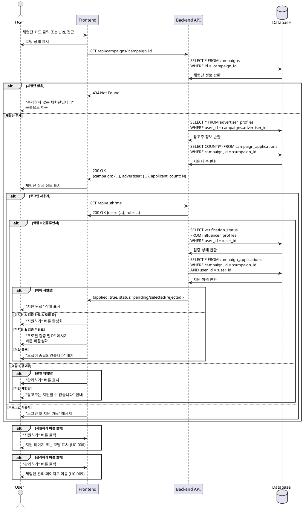

# UC-005: 체험단 상세

## Primary Actor
- 모든 로그인 사용자 (인플루언서, 광고주)

## Precondition
- 로그인된 상태
- 체험단 목록에서 특정 체험단 선택

## Trigger
- 사용자가 체험단 카드 클릭
- 체험단 상세 URL로 직접 접근

## Main Scenario

### 1. 체험단 상세 페이지 접근
1. 사용자가 체험단 카드를 클릭하거나 URL로 접근한다
2. 시스템이 체험단 ID를 확인한다
3. 시스템이 체험단 상세 정보를 조회한다

### 2. 체험단 정보 표시
1. 시스템이 체험단 상세 정보를 표시한다:
   - **기본 정보**
     - 체험단 제목
     - 업체명 및 카테고리
     - 위치 (지도 표시 선택사항)
   - **모집 정보**
     - 모집 기간 (시작일 ~ 종료일, D-day)
     - 체험 기간 (시작일 ~ 종료일)
     - 모집 인원 (현재 지원자 수 / 총 모집 인원)
     - 모집 상태 (모집 중 / 모집 종료 / 선정 완료)
   - **체험단 상세**
     - 상세 설명
     - 제공 혜택
     - 미션 내용
   - **이미지** (선택사항)
     - 체험단 대표 이미지
     - 추가 이미지 갤러리

### 3. 권한별 버튼 표시
1. 시스템이 사용자의 역할과 상태를 확인한다
2. **인플루언서인 경우**:
   - `verification_status = 'verified'`: "지원하기" 버튼 활성화
   - `verification_status != 'verified'`: "프로필 검증 필요" 메시지 및 버튼 비활성화
   - 이미 지원한 경우: "지원 완료" 상태 표시
3. **광고주인 경우**:
   - 본인의 체험단: "관리하기" 버튼 표시 (UC-009)
   - 타인의 체험단: 지원 불가 안내
4. **비로그인 사용자**:
   - "로그인 후 지원 가능" 메시지

### 4. 지원하기 버튼 클릭
1. 인플루언서가 "지원하기" 버튼을 클릭한다
2. 시스템이 지원 페이지 또는 지원 모달로 이동한다 (UC-006)

### 5. 공유 기능 (선택사항)
1. 사용자가 "공유하기" 버튼을 클릭한다
2. 시스템이 공유 옵션을 표시한다 (카카오톡, URL 복사 등)

## Edge Cases

### 존재하지 않는 체험단
- **발생 조건**: 유효하지 않은 campaign_id로 접근
- **처리**: "존재하지 않는 체험단입니다" 메시지 표시, 목록으로 이동

### 삭제된 체험단
- **발생 조건**: 삭제된 체험단에 접근
- **처리**: "삭제된 체험단입니다" 메시지 표시, 목록으로 이동

### 모집 종료된 체험단
- **발생 조건**: `status = 'closed'` 또는 `recruitment_end_date < NOW()`
- **처리**: "모집이 종료되었습니다" 배지 표시, 지원 버튼 비활성화

### 선정 완료된 체험단
- **발생 조건**: `status = 'selection_completed'`
- **처리**: "선정이 완료되었습니다" 배지 표시, 지원 불가

### 비로그인 사용자 접근
- **발생 조건**: 로그인하지 않은 상태로 접근
- **처리**: "로그인 후 지원할 수 있습니다" 메시지, 로그인 페이지 링크 제공

### 인플루언서 미검증 상태
- **발생 조건**: `influencer_profiles.verification_status != 'verified'`
- **처리**: "프로필 검증이 필요합니다" 메시지, 프로필 등록 페이지 링크 제공

### 이미 지원한 체험단
- **발생 조건**: `campaign_applications`에 이미 레코드 존재
- **처리**: "이미 지원한 체험단입니다" 메시지, 지원 상태 표시 (대기중/선정/반려)

### 모집 인원 초과
- **발생 조건**: 지원자 수가 모집 인원을 초과 (선착순인 경우)
- **처리**: "모집 인원이 마감되었습니다" 메시지

### 네트워크 오류
- **발생 조건**: 상세 정보 조회 중 오류
- **처리**: "일시적인 오류가 발생했습니다" 메시지, 재시도 버튼

### 권한 없는 접근 (비공개 체험단)
- **발생 조건**: 특정 조건에서만 볼 수 있는 체험단
- **처리**: "접근 권한이 없습니다" 메시지

## Business Rules

### BR-041: 상세 조회 권한
- 로그인한 모든 사용자는 체험단 상세 조회 가능
- 비로그인 사용자는 제한적 정보만 조회 가능 (선택사항)

### BR-042: 지원 가능 조건
- 역할이 '인플루언서'
- 인플루언서 검증 완료 (`verification_status = 'verified'`)
- 체험단이 모집 중 (`status = 'recruiting'`)
- 모집 기간 내 (`recruitment_end_date >= NOW()`)
- 중복 지원이 아님

### BR-043: 모집 상태 표시
- **모집 중**: 초록색 배지
- **모집 종료**: 회색 배지
- **선정 완료**: 파란색 배지

### BR-044: D-day 표시
- 모집 종료일 기준 D-day 계산
- D-day 3일 이하: 빨간색 강조
- D-day 0: "오늘 마감"
- 마감됨: "마감" 표시

### BR-045: 지원자 수 표시
- 실시간 지원자 수 표시
- "N명 지원 / 총 M명 모집"
- 모집 완료 시: "모집 완료"

### BR-046: 광고주 본인 체험단
- 본인이 등록한 체험단은 지원 불가
- "관리하기" 버튼으로 관리 페이지 이동 (UC-009)

### BR-047: 위치 정보
- 지도 표시 (선택사항)
- 주소 복사 기능
- 길찾기 링크 (카카오맵, 네이버지도)

### BR-048: 이미지 표시
- 대표 이미지 우선 표시
- 추가 이미지는 갤러리 형태
- 이미지 없을 시 기본 이미지 표시

### BR-049: 상세 설명 포맷
- 마크다운 또는 HTML 지원
- 링크, 이미지 삽입 가능
- XSS 방지 필터링

### BR-050: 조회수 카운트
- 상세 페이지 조회 시 조회수 증가
- 동일 사용자 중복 카운트 방지 (선택사항)

---

## Sequence Diagram

---

## Notes

### 구현 우선순위
1. **High**: 기본 정보 표시
2. **High**: 권한별 버튼 표시 로직
3. **Medium**: 이미지 갤러리
4. **Medium**: 지도 표시
5. **Low**: 공유 기능
6. **Low**: 조회수 카운트

### 기술적 고려사항
- 체험단 정보 캐싱 (1-5분)
- 이미지 최적화 (Lazy Loading, WebP)
- 지도 API 연동 (카카오맵, 네이버지도)
- 마크다운 렌더링 (보안 필터링)
- 조회수 증가 로직 (비동기 처리)
- 공유 URL 생성 (OG 태그)

### UI/UX 고려사항
- 정보 계층 구조 명확히 (중요 정보 상단)
- 지원 버튼 고정 (Sticky Button)
- D-day 강조 표시
- 모집 진행률 프로그레스 바
- 이미지 확대 보기 모달
- 반응형 디자인
- 뒤로가기 버튼
- 브레드크럼 네비게이션

