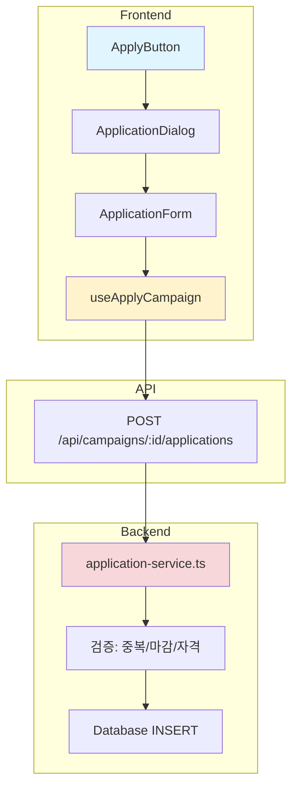

# UC-006: 체험단 지원 - 구현 계획

## 개요

### 모듈 목록

| 모듈 | 위치 | 설명 |
|------|------|------|
| **Backend - API Routes** | `src/features/campaign/backend/routes/application.ts` | 지원 CRUD API |
| **Backend - Services** | `src/features/campaign/backend/services/application-service.ts` | 지원 생성/검증 로직 |
| **Backend - Schema** | `src/features/campaign/backend/schema/application-schema.ts` | 지원 스키마 |
| **Backend - Error** | `src/features/campaign/backend/errors/application-error.ts` | 에러 코드 정의 |
| **Frontend - Components** | `src/features/campaign/components/ApplicationDialog.tsx` | 지원 Dialog |
| **Frontend - Components** | `src/features/campaign/components/ApplicationForm.tsx` | 지원 폼 |
| **Frontend - Hooks** | `src/features/campaign/hooks/useApplyCampaign.ts` | 지원 제출 훅 |

---

## Diagram



---

## Implementation Plan

### 1. Backend - Schema

```typescript
// src/features/campaign/backend/schema/application-schema.ts
export const CreateApplicationSchema = z.object({
  campaignId: z.string().uuid(),
  applicationMessage: z.string()
    .min(10, '지원 메시지는 10자 이상 입력해주세요')
    .max(1000, '지원 메시지는 1000자 이하로 입력해주세요'),
  visitDate: z.string()
    .refine((date) => {
      const visitDate = new Date(date);
      return visitDate > new Date();
    }, '방문 예정일은 오늘 이후여야 합니다'),
});

export type CreateApplicationRequest = z.infer<typeof CreateApplicationSchema>;

export const ApplicationResponseSchema = z.object({
  id: z.string().uuid(),
  campaignId: z.string().uuid(),
  status: z.enum(['pending', 'selected', 'rejected']),
  appliedAt: z.string(),
});
```

---

### 2. Backend - Service

```typescript
// src/features/campaign/backend/services/application-service.ts
export const createApplication = async (
  client: SupabaseClient,
  userId: string,
  request: CreateApplicationRequest
): Promise<HandlerResult<ApplicationResponse, ApplicationServiceError, unknown>> => {
  try {
    // 1. 캠페인 존재 및 상태 확인
    const { data: campaign, error: campaignError } = await client
      .from('campaigns')
      .select('id, status, recruitment_end_date, total_slots, selected_count')
      .eq('id', request.campaignId)
      .single();

    if (campaignError || !campaign) {
      return failure(404, errorCodes.campaignNotFound, '체험단을 찾을 수 없습니다');
    }

    // 2. 모집 중인지 확인
    if (campaign.status !== 'recruiting') {
      return failure(400, errorCodes.campaignClosed, '모집이 마감되었습니다');
    }

    // 3. 모집 기간 확인
    if (new Date(campaign.recruitment_end_date) < new Date()) {
      return failure(400, errorCodes.recruitmentEnded, '모집 기간이 종료되었습니다');
    }

    // 4. 중복 지원 확인
    const { data: existing } = await client
      .from('campaign_applications')
      .select('id')
      .eq('campaign_id', request.campaignId)
      .eq('user_id', userId)
      .maybeSingle();

    if (existing) {
      return failure(400, errorCodes.alreadyApplied, '이미 지원한 체험단입니다');
    }

    // 5. 인플루언서 프로필 확인
    const { data: profile } = await client
      .from('influencer_profiles')
      .select('user_id, verification_status')
      .eq('user_id', userId)
      .single();

    if (!profile) {
      return failure(403, errorCodes.notInfluencer, '인플루언서만 지원할 수 있습니다');
    }

    // 6. 지원서 생성
    const { data: application, error: insertError } = await client
      .from('campaign_applications')
      .insert({
        campaign_id: request.campaignId,
        user_id: userId,
        application_message: request.applicationMessage,
        visit_date: request.visitDate,
        status: 'pending',
      })
      .select()
      .single();

    if (insertError || !application) {
      return failure(500, errorCodes.insertFailed, '지원서 제출에 실패했습니다', insertError);
    }

    return success<ApplicationResponse>({
      id: application.id,
      campaignId: application.campaign_id,
      status: application.status,
      appliedAt: application.applied_at,
    }, 201);

  } catch (error) {
    return failure(500, errorCodes.internalError, '지원 처리 중 오류가 발생했습니다', error);
  }
};
```

**Unit Tests:**
```typescript
describe('createApplication', () => {
  it('should create application successfully', async () => {
    const request = {
      campaignId: 'campaign-id',
      applicationMessage: '열심히 리뷰하겠습니다!',
      visitDate: '2025-12-31',
    };
    const result = await createApplication(mockClient, 'user-id', request);
    expect(result.ok).toBe(true);
  });

  it('should reject duplicate application', async () => {
    // Mock existing application
    const result = await createApplication(mockClient, 'user-id', validRequest);
    expect(result.ok).toBe(false);
    if (!result.ok) {
      expect(result.error.code).toBe(errorCodes.alreadyApplied);
    }
  });

  it('should reject if campaign is closed', async () => {
    // Mock closed campaign
    const result = await createApplication(mockClient, 'user-id', validRequest);
    expect(result.ok).toBe(false);
    if (!result.ok) {
      expect(result.error.code).toBe(errorCodes.campaignClosed);
    }
  });

  it('should reject if not influencer', async () => {
    // Mock advertiser user
    const result = await createApplication(mockClient, 'advertiser-id', validRequest);
    expect(result.ok).toBe(false);
    if (!result.ok) {
      expect(result.error.code).toBe(errorCodes.notInfluencer);
    }
  });
});
```

---

### 3. Frontend - Component

```typescript
// src/features/campaign/components/ApplicationDialog.tsx
export const ApplicationDialog = ({ 
  campaignId, 
  open, 
  onClose 
}: ApplicationDialogProps) => {
  const apply = useApplyCampaign();
  const [message, setMessage] = useState('');
  const [visitDate, setVisitDate] = useState('');

  const handleSubmit = async () => {
    try {
      await apply.mutateAsync({
        campaignId,
        applicationMessage: message,
        visitDate,
      });
      toast.success('지원이 완료되었습니다!');
      onClose();
    } catch (error: any) {
      toast.error(error.message || '지원에 실패했습니다');
    }
  };

  return (
    <Dialog open={open} onOpenChange={onClose}>
      <DialogContent>
        <DialogHeader>
          <DialogTitle>체험단 지원하기</DialogTitle>
        </DialogHeader>

        <div className="space-y-4">
          {/* 지원 메시지 */}
          <div>
            <Label htmlFor="message">지원 메시지</Label>
            <Textarea
              id="message"
              placeholder="지원 동기와 리뷰 계획을 작성해주세요 (10자 이상)"
              value={message}
              onChange={(e) => setMessage(e.target.value)}
              rows={5}
            />
            <p className="text-sm text-gray-500 mt-1">
              {message.length} / 1000자
            </p>
          </div>

          {/* 방문 예정일 */}
          <div>
            <Label htmlFor="visitDate">방문 예정일</Label>
            <Input
              id="visitDate"
              type="date"
              value={visitDate}
              onChange={(e) => setVisitDate(e.target.value)}
              min={new Date().toISOString().split('T')[0]}
            />
          </div>
        </div>

        <DialogFooter>
          <Button variant="outline" onClick={onClose}>
            취소
          </Button>
          <Button 
            onClick={handleSubmit} 
            disabled={apply.isPending || message.length < 10 || !visitDate}
          >
            {apply.isPending ? '제출 중...' : '지원하기'}
          </Button>
        </DialogFooter>
      </DialogContent>
    </Dialog>
  );
};
```

**QA Sheet:**
```markdown
## Visual Tests
- [ ] Dialog가 중앙에 표시되는가?
- [ ] 입력 필드가 명확한가?
- [ ] 글자 수 카운터가 보이는가?

## Functional Tests
- [ ] 10자 미만 입력 시 제출 불가한가?
- [ ] 오늘 이전 날짜 선택 불가한가?
- [ ] 중복 지원 시 에러 메시지 표시되는가?
- [ ] 성공 시 Dialog가 닫히고 토스트 표시되는가?

## Validation Tests
- [ ] 1000자 초과 입력 방지되는가?
- [ ] 빈 메시지 제출 방지되는가?
```

---

## Summary

### 구현 순서
1. Schema & Error
2. Backend Service (검증 + 생성)
3. API Routes
4. Frontend Hook
5. UI Components (Dialog, Form)

### 테스트 체크리스트
- [ ] 중복 지원 방지
- [ ] 모집 마감 확인
- [ ] 인플루언서 권한 확인
- [ ] 입력 검증 (길이, 날짜)

