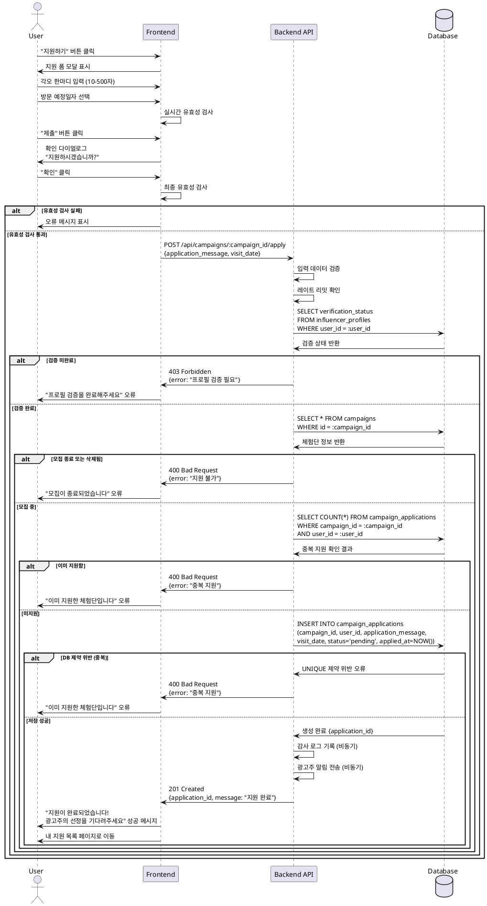

# UC-006: 체험단 지원

## Primary Actor
- 인플루언서 (검증 완료)

## Precondition
- 로그인된 상태
- 역할이 '인플루언서'
- 인플루언서 검증 완료 (`verification_status = 'verified'`)
- 체험단 상세 페이지에서 "지원하기" 버튼 클릭
- 체험단이 모집 중 상태
- 해당 체험단에 이미 지원하지 않은 상태

## Trigger
- 체험단 상세 페이지에서 "지원하기" 버튼 클릭

## Main Scenario

### 1. 지원 폼 표시
1. 사용자가 "지원하기" 버튼을 클릭한다
2. 시스템이 지원 폼을 표시한다 (모달 또는 새 페이지):
   - 체험단 제목 (읽기 전용)
   - 모집 기간 및 인원 (읽기 전용)
   - 각오 한마디 입력 필드 (Textarea)
   - 방문 예정일자 선택 필드 (Date Picker)

### 2. 지원서 작성
1. 사용자가 각오 한마디를 입력한다 (최소 10자, 최대 500자)
2. 사용자가 방문 예정일자를 선택한다:
   - 체험 시작일 ~ 체험 종료일 범위 내에서 선택
   - 오늘 이후 날짜만 선택 가능
3. 시스템이 입력 데이터를 실시간 검증한다

### 3. 지원서 제출 전 확인
1. 사용자가 "제출" 버튼을 클릭한다
2. 시스템이 최종 확인 다이얼로그를 표시한다:
   - "지원하시겠습니까?"
   - 작성한 내용 요약
   - "취소" / "확인" 버튼

### 4. 지원서 제출
1. 사용자가 "확인" 버튼을 클릭한다
2. 시스템이 유효성 검사를 수행한다:
   - 중복 지원 확인
   - 모집 기간 확인
   - 인플루언서 검증 상태 확인
   - 각오 및 방문일 유효성 확인
3. 시스템이 지원서를 저장한다:
   - `campaign_applications` INSERT
   - status = 'pending'
4. 시스템이 감사 로그를 기록한다 (선택사항)

### 5. 지원 완료 처리
1. 시스템이 성공 메시지를 표시한다:
   - "지원이 완료되었습니다"
   - "광고주의 선정을 기다려주세요"
2. 시스템이 사용자를 다음 페이지로 이동한다:
   - 내 지원 목록 페이지 (UC-007)
   - 또는 체험단 상세 페이지 (지원 완료 상태 표시)
3. 시스템이 광고주에게 알림을 전송한다 (선택사항):
   - "새로운 지원자가 있습니다"

## Edge Cases

### 각오 한마디 미입력
- **발생 조건**: 각오를 입력하지 않거나 10자 미만
- **처리**: "각오 한마디를 10자 이상 입력해주세요" 오류 메시지

### 방문 예정일자 미선택
- **발생 조건**: 방문일을 선택하지 않고 제출
- **처리**: "방문 예정일자를 선택해주세요" 오류 메시지

### 방문일 범위 벗어남
- **발생 조건**: 체험 기간 외의 날짜 선택
- **처리**: "체험 기간 내의 날짜를 선택해주세요" 오류 메시지

### 중복 지원
- **발생 조건**: 이미 지원한 체험단에 다시 지원 시도
- **처리**: "이미 지원한 체험단입니다" 오류 메시지, 지원 불가

### 모집 기간 종료
- **발생 조건**: 지원서 작성 중 모집 기간이 종료됨
- **처리**: "모집이 종료되어 지원할 수 없습니다" 메시지, 제출 불가

### 검증 상태 변경
- **발생 조건**: 지원 중 인플루언서 검증 상태가 변경됨
- **처리**: "프로필 검증 상태를 확인해주세요" 메시지

### 모집 인원 초과
- **발생 조건**: 지원자 수가 모집 인원 초과 (선착순)
- **처리**: "모집 인원이 마감되었습니다" 메시지

### 네트워크 오류
- **발생 조건**: 제출 중 네트워크 오류
- **처리**: "일시적인 오류가 발생했습니다. 다시 시도해주세요" 메시지

### 체험단 삭제됨
- **발생 조건**: 지원 중 광고주가 체험단 삭제
- **처리**: "삭제된 체험단입니다" 메시지

### 임시저장 (선택사항)
- **발생 조건**: 작성 중 페이지 이탈
- **처리**: 로컬스토리지에 임시저장, 재접근 시 복원

## Business Rules

### BR-051: 지원 가능 조건
- 인플루언서 검증 완료 (`verification_status = 'verified'`)
- 체험단 모집 중 (`status = 'recruiting'`)
- 모집 기간 내 (`recruitment_end_date >= NOW()`)
- 중복 지원 불가

### BR-052: 각오 한마디 규칙
- 최소 10자 이상
- 최대 500자 이하
- 특수문자 허용
- HTML 태그 제거 (XSS 방지)

### BR-053: 방문 예정일자 규칙
- 체험 시작일 ~ 체험 종료일 범위 내
- 오늘 이후 날짜만 선택 가능
- 과거 날짜 선택 불가

### BR-054: 중복 지원 방지
- `campaign_applications(campaign_id, user_id)` UNIQUE 제약
- 데이터베이스 레벨에서 중복 차단
- 애플리케이션 레벨 사전 체크

### BR-055: 지원 초기 상태
- 지원서 제출 시 `status = 'pending'`
- 광고주의 선정/반려 처리 전까지 대기 상태

### BR-056: 타임스탬프 기록
- `applied_at`: 지원 일시 자동 기록
- `updated_at`: 상태 변경 시 자동 업데이트

### BR-057: 지원서 수정 불가
- 제출 후 지원서 수정 불가
- 취소 후 재지원 가능 (선택사항)

### BR-058: 감사 로그
- 지원 이력 기록 (사용자, 시간, IP 등)
- 부정 지원 방지 및 추적

### BR-059: 알림 전송
- 광고주에게 신규 지원 알림 (선택사항)
- 인플루언서에게 지원 완료 확인 (선택사항)

### BR-060: 레이트 리밋
- 동일 사용자가 1분 내 최대 5회 지원 가능
- 스팸 지원 방지

---

## Sequence Diagram

---

## Notes

### 구현 우선순위
1. **High**: 기본 지원 기능 (각오, 방문일)
2. **High**: 중복 지원 방지
3. **Medium**: 유효성 검사 및 오류 처리
4. **Medium**: 알림 기능
5. **Low**: 임시저장 기능
6. **Low**: 지원 취소 기능

### 기술적 고려사항
- 중복 지원 방지 (데이터베이스 UNIQUE 제약)
- 트랜잭션 처리 (원자성 보장)
- 레이트 리밋 (Redis)
- 감사 로그 (별도 테이블 또는 로깅 시스템)
- 알림 큐 (비동기 처리)
- 임시저장 (로컬스토리지)

### UI/UX 고려사항
- 모달 또는 별도 페이지 선택
- 각오 글자 수 카운터 표시
- 방문일 선택 시 달력 UI
- 체험 기간 강조 표시
- 확인 다이얼로그
- 제출 중 로딩 상태
- 성공/실패 피드백 명확히
- 지원 완료 후 다음 액션 안내

