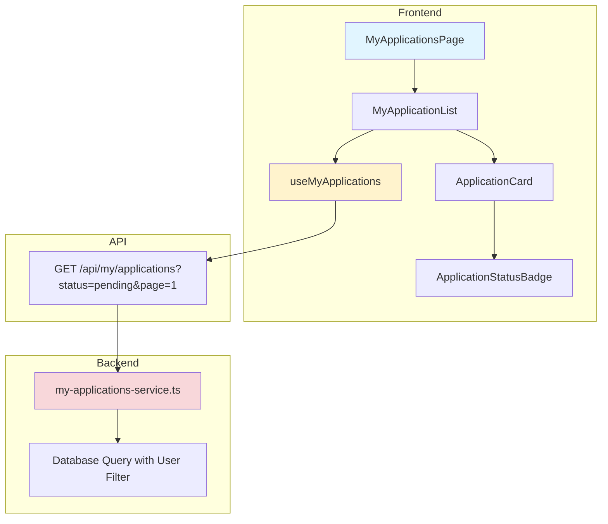

# UC-007: 내 지원 목록 (인플루언서 전용) - 구현 계획

## 개요

### 모듈 목록

| 모듈 | 위치 | 설명 |
|------|------|------|
| **Backend - API Routes** | `src/features/campaign/backend/routes/my-applications.ts` | 내 지원 목록 조회 API |
| **Backend - Services** | `src/features/campaign/backend/services/my-applications-service.ts` | 지원 목록 조회 로직 |
| **Backend - Schema** | `src/features/campaign/backend/schema/my-applications-schema.ts` | 목록 스키마 |
| **Frontend - Pages** | `src/app/(protected)/my-applications/page.tsx` | 내 지원 목록 페이지 |
| **Frontend - Components** | `src/features/campaign/components/MyApplicationList.tsx` | 지원 목록 컴포넌트 |
| **Frontend - Components** | `src/features/campaign/components/ApplicationCard.tsx` | 지원 카드 |
| **Frontend - Components** | `src/features/campaign/components/ApplicationStatusBadge.tsx` | 상태 뱃지 |
| **Frontend - Hooks** | `src/features/campaign/hooks/useMyApplications.ts` | 목록 조회 훅 |

---

## Diagram



---

## Implementation Plan

### 1. Backend - Schema

```typescript
// src/features/campaign/backend/schema/my-applications-schema.ts
export const MyApplicationsQuerySchema = z.object({
  status: z.enum(['pending', 'selected', 'rejected']).optional(),
  page: z.coerce.number().int().min(1).default(1),
  limit: z.coerce.number().int().min(1).max(50).default(20),
});

export const MyApplicationItemSchema = z.object({
  applicationId: z.string().uuid(),
  status: z.enum(['pending', 'selected', 'rejected']),
  appliedAt: z.string(),
  visitDate: z.string(),
  
  campaign: z.object({
    id: z.string().uuid(),
    title: z.string(),
    businessName: z.string(),
    category: z.string(),
    location: z.string(),
    recruitmentEndDate: z.string(),
    status: z.enum(['recruiting', 'closed', 'selection_completed']),
  }),
});

export const MyApplicationsResponseSchema = z.object({
  applications: z.array(MyApplicationItemSchema),
  total: z.number(),
  page: z.number(),
  hasMore: z.boolean(),
});

export type MyApplicationsResponse = z.infer<typeof MyApplicationsResponseSchema>;
```

---

### 2. Backend - Service

```typescript
// src/features/campaign/backend/services/my-applications-service.ts
export const getMyApplications = async (
  client: SupabaseClient,
  userId: string,
  query: MyApplicationsQuery
): Promise<HandlerResult<MyApplicationsResponse, ServiceError, unknown>> => {
  try {
    // 1. 쿼리 빌드
    let queryBuilder = client
      .from('campaign_applications')
      .select(`
        id,
        status,
        applied_at,
        visit_date,
        campaign:campaigns!inner(
          id,
          title,
          status,
          recruitment_end_date,
          advertiser:advertiser_profiles!inner(
            business_name,
            category,
            location
          )
        )
      `, { count: 'exact' })
      .eq('user_id', userId);

    // 2. 필터 적용
    if (query.status) {
      queryBuilder = queryBuilder.eq('status', query.status);
    }

    // 3. 정렬 (최신순)
    queryBuilder = queryBuilder.order('applied_at', { ascending: false });

    // 4. 페이지네이션
    const offset = (query.page - 1) * query.limit;
    queryBuilder = queryBuilder.range(offset, offset + query.limit - 1);

    const { data, error, count } = await queryBuilder;

    if (error) {
      return failure(500, 'FETCH_ERROR', '목록 조회 실패', error);
    }

    // 5. 응답 매핑
    const applications = data.map((item: any) => ({
      applicationId: item.id,
      status: item.status,
      appliedAt: item.applied_at,
      visitDate: item.visit_date,
      campaign: {
        id: item.campaign.id,
        title: item.campaign.title,
        businessName: item.campaign.advertiser.business_name,
        category: item.campaign.advertiser.category,
        location: item.campaign.advertiser.location,
        recruitmentEndDate: item.campaign.recruitment_end_date,
        status: item.campaign.status,
      },
    }));

    return success<MyApplicationsResponse>({
      applications,
      total: count || 0,
      page: query.page,
      hasMore: (count || 0) > offset + query.limit,
    });

  } catch (error) {
    return failure(500, 'INTERNAL_ERROR', '오류 발생', error);
  }
};
```

**Unit Tests:**
```typescript
describe('getMyApplications', () => {
  it('should return user applications', async () => {
    const result = await getMyApplications(mockClient, 'user-id', { page: 1 });
    expect(result.ok).toBe(true);
  });

  it('should filter by status', async () => {
    const result = await getMyApplications(mockClient, 'user-id', { 
      status: 'selected', 
      page: 1 
    });
    expect(result.ok).toBe(true);
  });

  it('should return empty array if no applications', async () => {
    const result = await getMyApplications(mockClient, 'new-user-id', { page: 1 });
    expect(result.ok).toBe(true);
    if (result.ok) {
      expect(result.data.applications).toHaveLength(0);
    }
  });
});
```

---

### 3. Frontend - Component

```typescript
// src/features/campaign/components/MyApplicationList.tsx
export const MyApplicationList = () => {
  const [statusFilter, setStatusFilter] = useState<ApplicationStatus | 'all'>('all');
  const { data, isLoading, fetchNextPage, hasNextPage } = useMyApplications(
    statusFilter === 'all' ? undefined : statusFilter
  );

  if (isLoading) return <Skeleton />;

  const applications = data?.pages.flatMap(page => page.applications) || [];

  if (applications.length === 0) {
    return (
      <EmptyState
        icon={<FileText />}
        title="지원 내역이 없습니다"
        description="체험단에 지원하면 여기서 확인할 수 있습니다"
        action={
          <Button asChild>
            <Link href="/">체험단 둘러보기</Link>
          </Button>
        }
      />
    );
  }

  return (
    <div className="space-y-6">
      {/* 필터 */}
      <div className="flex gap-2">
        <Button
          variant={statusFilter === 'all' ? 'default' : 'outline'}
          onClick={() => setStatusFilter('all')}
        >
          전체
        </Button>
        <Button
          variant={statusFilter === 'pending' ? 'default' : 'outline'}
          onClick={() => setStatusFilter('pending')}
        >
          대기중
        </Button>
        <Button
          variant={statusFilter === 'selected' ? 'default' : 'outline'}
          onClick={() => setStatusFilter('selected')}
        >
          선정
        </Button>
        <Button
          variant={statusFilter === 'rejected' ? 'default' : 'outline'}
          onClick={() => setStatusFilter('rejected')}
        >
          미선정
        </Button>
      </div>

      {/* 목록 */}
      <div className="space-y-4">
        {applications.map(application => (
          <ApplicationCard key={application.applicationId} application={application} />
        ))}
      </div>

      {/* 더보기 */}
      {hasNextPage && (
        <Button onClick={() => fetchNextPage()} variant="outline" className="w-full">
          더보기
        </Button>
      )}
    </div>
  );
};
```

```typescript
// src/features/campaign/components/ApplicationCard.tsx
export const ApplicationCard = ({ application }: { application: MyApplicationItem }) => {
  return (
    <Card>
      <CardContent className="p-6">
        <div className="flex justify-between items-start">
          <div className="flex-1">
            <div className="flex items-center gap-2 mb-2">
              <Link href={`/campaigns/${application.campaign.id}`}>
                <h3 className="text-lg font-semibold hover:underline">
                  {application.campaign.title}
                </h3>
              </Link>
              <ApplicationStatusBadge status={application.status} />
            </div>
            
            <p className="text-gray-600">{application.campaign.businessName}</p>
            
            <div className="flex gap-4 mt-3 text-sm text-gray-500">
              <span>📍 {application.campaign.location}</span>
              <span>🗓️ 방문 예정: {formatDate(application.visitDate)}</span>
            </div>
          </div>
          
          <div className="text-right text-sm text-gray-500">
            <p>지원일: {formatDate(application.appliedAt)}</p>
          </div>
        </div>
      </CardContent>
    </Card>
  );
};
```

```typescript
// src/features/campaign/components/ApplicationStatusBadge.tsx
export const ApplicationStatusBadge = ({ status }: { status: ApplicationStatus }) => {
  const variants: Record<ApplicationStatus, { label: string; color: string }> = {
    pending: { label: '대기중', color: 'bg-yellow-100 text-yellow-800' },
    selected: { label: '선정됨', color: 'bg-green-100 text-green-800' },
    rejected: { label: '미선정', color: 'bg-gray-100 text-gray-800' },
  };

  const { label, color } = variants[status];

  return (
    <Badge className={color}>
      {label}
    </Badge>
  );
};
```

**QA Sheet:**
```markdown
## Visual Tests
- [ ] 상태별 필터 버튼이 명확한가?
- [ ] 카드가 깔끔하게 정렬되는가?
- [ ] 상태 뱃지 색상이 적절한가?
- [ ] 빈 상태 UI가 명확한가?

## Functional Tests
- [ ] 필터 변경 시 목록이 업데이트되는가?
- [ ] 캠페인 제목 클릭 시 상세로 이동하는가?
- [ ] 무한 스크롤/더보기가 작동하는가?
- [ ] 로딩 상태가 표시되는가?

## Data Tests
- [ ] 날짜 포맷이 올바른가?
- [ ] 상태가 정확히 표시되는가?
```

---

## Summary

### 구현 순서
1. Schema (Query & Response)
2. Backend Service (필터링 + 정렬)
3. API Routes
4. Frontend Hooks (Infinite Query)
5. UI Components (List, Card, Badge)
6. Page Integration

### 테스트 체크리스트
- [ ] 사용자별 지원 목록 조회
- [ ] 상태별 필터링
- [ ] 페이지네이션
- [ ] 빈 상태 처리

