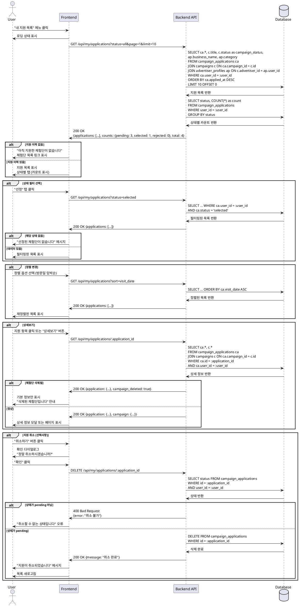

# UC-007: 내 지원 목록 (인플루언서 전용)

## Primary Actor
- 인플루언서

## Precondition
- 로그인된 상태
- 역할이 '인플루언서'

## Trigger
- 인플루언서가 "내 지원 목록" 메뉴 클릭
- 마이페이지에서 지원 목록 탭 선택
- 체험단 지원 완료 후 자동 이동

## Main Scenario

### 1. 지원 목록 페이지 접근
1. 사용자가 "내 지원 목록" 메뉴를 클릭한다
2. 시스템이 지원 목록 페이지를 표시한다

### 2. 지원 목록 조회
1. 시스템이 사용자의 모든 지원 이력을 조회한다
2. 시스템이 상태별 탭을 표시한다:
   - 전체
   - 신청완료 (pending)
   - 선정 (selected)
   - 반려 (rejected)
3. 시스템이 기본적으로 "전체" 탭의 목록을 표시한다 (최신순)

### 3. 지원 목록 표시
1. 각 지원 항목에 다음 정보를 표시한다:
   - 체험단 제목 및 썸네일
   - 업체명 및 카테고리
   - 지원 일시
   - 방문 예정일자
   - 지원 상태 배지 (대기중/선정/반려)
   - 모집 기간 및 체험 기간
2. 지원 상태에 따른 액션 버튼:
   - 대기중: "상세보기", "취소하기" (선택사항)
   - 선정: "상세보기", "체험 인증하기" (선택사항)
   - 반려: "상세보기"

### 4. 상태 필터 적용
1. 사용자가 상태 탭을 클릭한다 (신청완료/선정/반려)
2. 시스템이 선택한 상태의 지원 목록만 필터링하여 표시한다
3. 시스템이 각 탭에 해당 상태의 개수를 표시한다

### 5. 정렬 변경
1. 사용자가 정렬 옵션을 선택한다:
   - 최신순 (기본)
   - 과거순
   - 방문일 임박순
2. 시스템이 선택한 기준으로 목록을 재정렬한다

### 6. 상세보기
1. 사용자가 지원 항목을 클릭하거나 "상세보기" 버튼을 클릭한다
2. 시스템이 다음 정보를 표시한다 (모달 또는 상세 페이지):
   - 체험단 전체 정보
   - 내가 작성한 각오 한마디
   - 방문 예정일자
   - 지원 일시
   - 지원 상태 및 피드백 (선정/반려 사유)

### 7. 페이지네이션
1. 시스템이 한 페이지에 10개의 지원 이력을 표시한다
2. 사용자가 페이지를 이동한다
3. 시스템이 해당 페이지의 데이터를 로드한다

## Edge Cases

### 지원 이력 없음
- **발생 조건**: 아직 지원한 체험단이 없음
- **처리**: "아직 지원한 체험단이 없습니다" 메시지, 체험단 목록 링크 제공

### 특정 상태 데이터 없음
- **발생 조건**: 특정 상태 탭에 해당하는 데이터 없음
- **처리**: "해당 상태의 지원이 없습니다" 메시지

### 네트워크 오류
- **발생 조건**: 목록 조회 중 오류 발생
- **처리**: "일시적인 오류가 발생했습니다" 메시지, 재시도 버튼

### 삭제된 체험단
- **발생 조건**: 지원했던 체험단이 광고주에 의해 삭제됨
- **처리**: 체험단 제목을 회색으로 표시, "(삭제됨)" 표시, 상세보기 불가

### 로딩 지연
- **발생 조건**: 대용량 데이터 또는 느린 네트워크
- **처리**: 스켈레톤 UI 또는 로딩 스피너 표시

### 지원 취소 (선택사항)
- **발생 조건**: 대기중 상태에서 취소 시도
- **처리**: 확인 다이얼로그 후 상태를 'cancelled'로 변경 또는 레코드 삭제

### 페이지네이션 끝
- **발생 조건**: 마지막 페이지 도달
- **처리**: 다음 페이지 버튼 비활성화

### 권한 없는 접근
- **발생 조건**: 광고주가 이 페이지 접근 시도
- **처리**: "인플루언서만 접근 가능합니다" 메시지, 홈으로 리디렉션

## Business Rules

### BR-061: 접근 권한
- 인플루언서만 접근 가능
- 광고주 접근 시 차단

### BR-062: 조회 범위
- 본인이 지원한 체험단만 조회 가능
- 타인의 지원 이력 조회 불가

### BR-063: 지원 상태
- **pending**: 신청완료, 광고주 검토 중
- **selected**: 선정됨
- **rejected**: 반려됨
- **cancelled**: 취소됨 (선택사항)

### BR-064: 상태별 배지 색상
- **pending**: 노란색 또는 파란색
- **selected**: 초록색
- **rejected**: 빨간색 또는 회색

### BR-065: 기본 정렬
- 지원 일시 기준 최신순 (applied_at DESC)
- 사용자가 변경하지 않는 한 유지

### BR-066: 상태별 카운트
- 각 탭에 해당 상태의 지원 개수 표시
- 예: "신청완료 (3)", "선정 (1)", "반려 (0)"

### BR-067: 페이지네이션
- 한 페이지당 10개 또는 20개 표시
- 페이지 번호 방식 또는 무한 스크롤

### BR-068: 삭제된 체험단 처리
- 삭제된 체험단도 지원 이력에는 유지
- 제목 및 기본 정보만 표시 (회색 처리)
- 상세 정보 조회 불가

### BR-069: 선정 피드백
- 선정 시 광고주의 메시지 표시 (선택사항)
- 반려 시 사유 표시 (선택사항)

### BR-070: 지원 취소 제한
- 대기중(pending) 상태에서만 취소 가능
- 선정/반려 후에는 취소 불가

---

## Sequence Diagram

---

## Notes

### 구현 우선순위
1. **High**: 기본 목록 조회 및 표시
2. **High**: 상태별 필터링
3. **Medium**: 상세보기
4. **Medium**: 페이지네이션
5. **Low**: 지원 취소 기능
6. **Low**: 체험 인증 기능

### 기술적 고려사항
- JOIN 쿼리 최적화 (인덱스 활용)
- 페이지네이션: offset 방식 또는 cursor 방식
- 캐싱 전략 (자주 변경되지 않는 데이터)
- 삭제된 체험단 처리 (Soft Delete 권장)
- 상태별 카운트 집계 쿼리 최적화

### UI/UX 고려사항
- 상태별 탭 UI (Material Design Tabs)
- 지원 이력 카드 디자인
- 상태 배지 색상 및 아이콘
- 스켈레톤 UI (로딩 상태)
- 빈 상태(Empty State) 디자인
- 모바일 반응형 디자인
- 상세보기 모달 또는 슬라이드 패널
- 필터 및 정렬 UI

