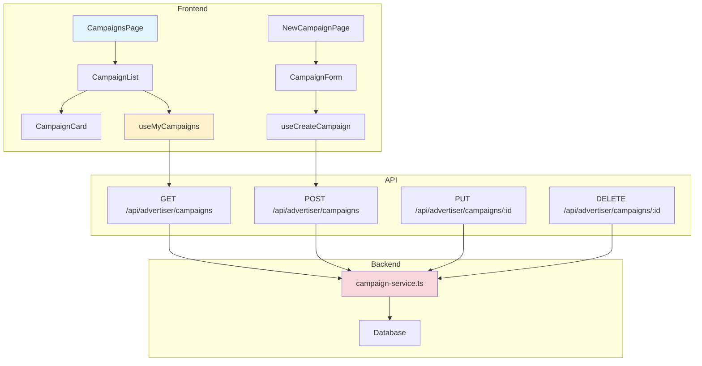

# UC-008: 광고주 체험단 관리 - 구현 계획

## 개요

### 모듈 목록

| 모듈 | 위치 | 설명 |
|------|------|------|
| **Backend - API Routes** | `src/features/advertiser/backend/routes/campaigns.ts` | 광고주 캠페인 CRUD API |
| **Backend - Services** | `src/features/advertiser/backend/services/campaign-service.ts` | 캠페인 생성/조회/수정/삭제 로직 |
| **Backend - Schema** | `src/features/advertiser/backend/schema/campaign-schema.ts` | 캠페인 스키마 |
| **Backend - Error** | `src/features/advertiser/backend/errors/campaign-error.ts` | 에러 코드 정의 |
| **Frontend - Pages** | `src/app/(protected)/advertiser/campaigns/page.tsx` | 캠페인 목록 페이지 |
| **Frontend - Pages** | `src/app/(protected)/advertiser/campaigns/new/page.tsx` | 캠페인 생성 페이지 |
| **Frontend - Components** | `src/features/advertiser/components/CampaignList.tsx` | 캠페인 목록 |
| **Frontend - Components** | `src/features/advertiser/components/CampaignForm.tsx` | 캠페인 등록/수정 폼 |
| **Frontend - Hooks** | `src/features/advertiser/hooks/useMyCampaigns.ts` | 내 캠페인 조회 훅 |
| **Frontend - Hooks** | `src/features/advertiser/hooks/useCreateCampaign.ts` | 캠페인 생성 훅 |
| **Frontend - Hooks** | `src/features/advertiser/hooks/useUpdateCampaign.ts` | 캠페인 수정 훅 |
| **Frontend - Hooks** | `src/features/advertiser/hooks/useDeleteCampaign.ts` | 캠페인 삭제 훅 |

---

## Diagram



---

## Implementation Plan

### 1. Backend - Schema

```typescript
// src/features/advertiser/backend/schema/campaign-schema.ts
export const CreateCampaignSchema = z.object({
  title: z.string().min(5, '제목은 5자 이상').max(255),
  description: z.string().min(20, '상세 설명은 20자 이상').max(5000),
  benefits: z.string().min(10, '혜택은 10자 이상').max(2000),
  mission: z.string().min(10, '미션은 10자 이상').max(2000),
  location: z.string().min(5, '위치를 입력해주세요'),
  
  recruitmentStartDate: z.string().refine((date) => new Date(date) >= new Date(), {
    message: '모집 시작일은 오늘 이후여야 합니다',
  }),
  recruitmentEndDate: z.string(),
  experienceStartDate: z.string(),
  experienceEndDate: z.string(),
  
  totalSlots: z.number().int().min(1, '최소 1명 이상').max(100, '최대 100명'),
}).refine((data) => {
  const start = new Date(data.recruitmentStartDate);
  const end = new Date(data.recruitmentEndDate);
  return end > start;
}, {
  message: '모집 종료일은 시작일 이후여야 합니다',
  path: ['recruitmentEndDate'],
}).refine((data) => {
  const expStart = new Date(data.experienceStartDate);
  const expEnd = new Date(data.experienceEndDate);
  return expEnd >= expStart;
}, {
  message: '체험 종료일은 시작일 이후여야 합니다',
  path: ['experienceEndDate'],
}).refine((data) => {
  const recruitEnd = new Date(data.recruitmentEndDate);
  const expStart = new Date(data.experienceStartDate);
  return expStart >= recruitEnd;
}, {
  message: '체험 시작일은 모집 종료일 이후여야 합니다',
  path: ['experienceStartDate'],
});

export type CreateCampaignRequest = z.infer<typeof CreateCampaignSchema>;

export const UpdateCampaignSchema = CreateCampaignSchema.partial();
```

---

### 2. Backend - Service

```typescript
// src/features/advertiser/backend/services/campaign-service.ts
export const createCampaign = async (
  client: SupabaseClient,
  advertiserId: string,
  request: CreateCampaignRequest
): Promise<HandlerResult<CampaignResponse, CampaignServiceError, unknown>> => {
  try {
    // 1. 광고주 프로필 확인
    const { data: profile } = await client
      .from('advertiser_profiles')
      .select('user_id, verification_status')
      .eq('user_id', advertiserId)
      .single();

    if (!profile) {
      return failure(403, errorCodes.notAdvertiser, '광고주만 캠페인을 생성할 수 있습니다');
    }

    if (profile.verification_status !== 'verified') {
      return failure(403, errorCodes.notVerified, '인증된 광고주만 캠페인을 생성할 수 있습니다');
    }

    // 2. 캠페인 생성
    const { data: campaign, error } = await client
      .from('campaigns')
      .insert({
        advertiser_id: advertiserId,
        title: request.title,
        description: request.description,
        benefits: request.benefits,
        mission: request.mission,
        location: request.location,
        recruitment_start_date: request.recruitmentStartDate,
        recruitment_end_date: request.recruitmentEndDate,
        experience_start_date: request.experienceStartDate,
        experience_end_date: request.experienceEndDate,
        total_slots: request.totalSlots,
        status: 'recruiting',
      })
      .select()
      .single();

    if (error || !campaign) {
      return failure(500, errorCodes.createFailed, '캠페인 생성에 실패했습니다', error);
    }

    return success(campaign, 201);

  } catch (error) {
    return failure(500, errorCodes.internalError, '오류 발생', error);
  }
};

export const getMyCampaigns = async (
  client: SupabaseClient,
  advertiserId: string,
  query: CampaignListQuery
): Promise<HandlerResult<CampaignListResponse, ServiceError, unknown>> => {
  try {
    let queryBuilder = client
      .from('campaigns')
      .select(`
        *,
        applicant_count:campaign_applications(count)
      `, { count: 'exact' })
      .eq('advertiser_id', advertiserId);

    // 필터
    if (query.status) {
      queryBuilder = queryBuilder.eq('status', query.status);
    }

    // 정렬
    queryBuilder = queryBuilder.order('created_at', { ascending: false });

    // 페이지네이션
    const offset = (query.page - 1) * query.limit;
    queryBuilder = queryBuilder.range(offset, offset + query.limit - 1);

    const { data, error, count } = await queryBuilder;

    if (error) {
      return failure(500, 'FETCH_ERROR', '목록 조회 실패', error);
    }

    return success({
      campaigns: data,
      total: count || 0,
      page: query.page,
      hasMore: (count || 0) > offset + query.limit,
    });

  } catch (error) {
    return failure(500, 'INTERNAL_ERROR', '오류 발생', error);
  }
};

export const deleteCampaign = async (
  client: SupabaseClient,
  advertiserId: string,
  campaignId: string
): Promise<HandlerResult<void, CampaignServiceError, unknown>> => {
  try {
    // 1. 소유권 확인
    const { data: campaign } = await client
      .from('campaigns')
      .select('advertiser_id, status')
      .eq('id', campaignId)
      .single();

    if (!campaign) {
      return failure(404, errorCodes.notFound, '캠페인을 찾을 수 없습니다');
    }

    if (campaign.advertiser_id !== advertiserId) {
      return failure(403, errorCodes.forbidden, '권한이 없습니다');
    }

    // 2. 선정 완료된 경우 삭제 불가
    if (campaign.status === 'selection_completed') {
      return failure(400, errorCodes.cannotDelete, '선정 완료된 캠페인은 삭제할 수 없습니다');
    }

    // 3. 삭제
    const { error } = await client
      .from('campaigns')
      .delete()
      .eq('id', campaignId);

    if (error) {
      return failure(500, errorCodes.deleteFailed, '삭제 실패', error);
    }

    return success(undefined);

  } catch (error) {
    return failure(500, errorCodes.internalError, '오류 발생', error);
  }
};
```

**Unit Tests:**
```typescript
describe('CampaignService', () => {
  describe('createCampaign', () => {
    it('should create campaign for verified advertiser', async () => {
      const result = await createCampaign(mockClient, 'advertiser-id', validRequest);
      expect(result.ok).toBe(true);
    });

    it('should reject if not advertiser', async () => {
      const result = await createCampaign(mockClient, 'influencer-id', validRequest);
      expect(result.ok).toBe(false);
    });

    it('should reject if not verified', async () => {
      // Mock unverified advertiser
      const result = await createCampaign(mockClient, 'unverified-id', validRequest);
      expect(result.ok).toBe(false);
    });
  });

  describe('deleteCampaign', () => {
    it('should delete campaign', async () => {
      const result = await deleteCampaign(mockClient, 'advertiser-id', 'campaign-id');
      expect(result.ok).toBe(true);
    });

    it('should reject if not owner', async () => {
      const result = await deleteCampaign(mockClient, 'other-id', 'campaign-id');
      expect(result.ok).toBe(false);
    });

    it('should reject if selection completed', async () => {
      // Mock completed campaign
      const result = await deleteCampaign(mockClient, 'advertiser-id', 'completed-id');
      expect(result.ok).toBe(false);
    });
  });
});
```

---

### 3. Frontend - Component

```typescript
// src/features/advertiser/components/CampaignForm.tsx
export const CampaignForm = ({ 
  initialData, 
  onSuccess 
}: CampaignFormProps) => {
  const createCampaign = useCreateCampaign();
  const updateCampaign = useUpdateCampaign();
  
  const form = useForm<CreateCampaignRequest>({
    resolver: zodResolver(CreateCampaignSchema),
    defaultValues: initialData || {
      title: '',
      description: '',
      benefits: '',
      mission: '',
      location: '',
      totalSlots: 5,
    },
  });

  const onSubmit = async (data: CreateCampaignRequest) => {
    if (initialData) {
      await updateCampaign.mutateAsync({ id: initialData.id, data });
    } else {
      await createCampaign.mutateAsync(data);
    }
    onSuccess?.();
  };

  return (
    <Form {...form}>
      <form onSubmit={form.handleSubmit(onSubmit)} className="space-y-6">
        <FormField name="title" label="체험단 제목" />
        <FormField name="description" label="상세 설명" as="textarea" />
        <FormField name="benefits" label="제공 혜택" as="textarea" />
        <FormField name="mission" label="미션" as="textarea" />
        <FormField name="location" label="위치" />
        
        <div className="grid grid-cols-2 gap-4">
          <FormField name="recruitmentStartDate" label="모집 시작일" type="date" />
          <FormField name="recruitmentEndDate" label="모집 종료일" type="date" />
        </div>
        
        <div className="grid grid-cols-2 gap-4">
          <FormField name="experienceStartDate" label="체험 시작일" type="date" />
          <FormField name="experienceEndDate" label="체험 종료일" type="date" />
        </div>
        
        <FormField name="totalSlots" label="모집 인원" type="number" />
        
        <Button type="submit" disabled={createCampaign.isPending || updateCampaign.isPending}>
          {initialData ? '수정하기' : '등록하기'}
        </Button>
      </form>
    </Form>
  );
};
```

**QA Sheet:**
```markdown
- [ ] 날짜 간 유효성 검사가 작동하는가?
- [ ] 긴 텍스트 입력이 정상 처리되는가?
- [ ] 모집 인원 최소/최대 검증되는가?
- [ ] 임시저장 기능이 필요한가? (향후)
```

---

## Summary

### 구현 순서
1. Schema & Error
2. Backend Services (CRUD)
3. API Routes
4. Frontend Hooks
5. UI Components (Form, List)
6. Pages Integration

### 테스트 체크리스트
- [ ] 캠페인 생성 (인증 확인)
- [ ] 내 캠페인 목록 조회
- [ ] 캠페인 수정
- [ ] 캠페인 삭제 (권한/상태 확인)

