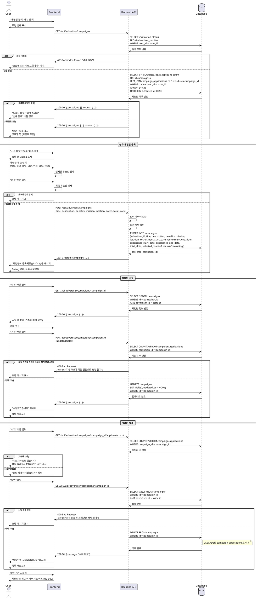

# UC-008: 광고주 체험단 관리

## Primary Actor
- 광고주 (검증 완료)

## Precondition
- 로그인된 상태
- 역할이 '광고주'
- 광고주 검증 완료 (`verification_status = 'verified'`)

## Trigger
- 광고주가 "체험단 관리" 메뉴 클릭
- 대시보드에서 체험단 관리 섹션 접근

## Main Scenario

### 1. 체험단 관리 페이지 접근
1. 사용자가 "체험단 관리" 메뉴를 클릭한다
2. 시스템이 체험단 관리 페이지를 표시한다:
   - "신규 체험단 등록" 버튼 (상단 또는 고정 위치)
   - 내가 등록한 체험단 목록
   - 상태별 필터 탭

### 2. 체험단 목록 조회
1. 시스템이 광고주가 등록한 모든 체험단을 조회한다
2. 시스템이 상태별 탭을 표시한다:
   - 전체
   - 모집 중 (recruiting)
   - 모집 종료 (closed)
   - 선정 완료 (selection_completed)
3. 각 체험단 카드에 다음 정보를 표시한다:
   - 체험단 제목
   - 등록일
   - 모집 기간 (D-day 표시)
   - 모집 상태 배지
   - 지원자 수 / 모집 인원
   - 액션 버튼: "상세/관리", "수정", "삭제"

### 3. 신규 체험단 등록
1. 사용자가 "신규 체험단 등록" 버튼을 클릭한다
2. 시스템이 등록 폼을 표시한다 (Dialog 또는 새 페이지):
   - **기본 정보**
     - 체험단 제목 (필수)
     - 상세 설명 (필수)
     - 제공 혜택 (필수)
     - 미션 내용 (필수)
   - **장소**
     - 위치 (주소 검색 또는 직접 입력) (필수)
   - **모집 기간**
     - 모집 시작일 (필수)
     - 모집 종료일 (필수)
   - **체험 기간**
     - 체험 시작일 (필수)
     - 체험 종료일 (필수)
   - **모집 인원**
     - 총 모집 인원 (필수, 양수)
   - **이미지** (선택사항)

### 4. 등록 폼 작성
1. 사용자가 체험단 정보를 입력한다
2. 시스템이 실시간으로 유효성을 검증한다:
   - 제목: 5-255자
   - 설명, 혜택, 미션: 10자 이상
   - 모집 종료일 >= 모집 시작일
   - 체험 종료일 >= 체험 시작일
   - 체험 시작일 >= 모집 종료일 (권장)
   - 모집 인원: 1명 이상

### 5. 체험단 등록 제출
1. 사용자가 "등록" 버튼을 클릭한다
2. 시스템이 최종 유효성을 검사한다
3. 시스템이 체험단을 생성한다:
   - `campaigns` INSERT
   - `status = 'recruiting'`
   - `selected_count = 0`
4. 시스템이 성공 메시지를 표시한다
5. 시스템이 등록된 체험단을 목록에 추가한다

### 6. 체험단 수정
1. 사용자가 체험단의 "수정" 버튼을 클릭한다
2. 시스템이 수정 폼을 표시한다 (기존 데이터 로드)
3. 사용자가 정보를 수정한다
4. 사용자가 "저장" 버튼을 클릭한다
5. 시스템이 변경사항을 저장한다

### 7. 체험단 삭제
1. 사용자가 체험단의 "삭제" 버튼을 클릭한다
2. 시스템이 확인 다이얼로그를 표시한다:
   - "정말 삭제하시겠습니까?"
   - "지원자 정보도 함께 삭제됩니다" 경고
3. 사용자가 "확인" 버튼을 클릭한다
4. 시스템이 체험단을 삭제한다 (CASCADE)
5. 시스템이 목록을 갱신한다

### 8. 체험단 상세/관리
1. 사용자가 체험단 카드를 클릭하거나 "상세/관리" 버튼을 클릭한다
2. 시스템이 체험단 상세 관리 페이지로 이동한다 (UC-009)

## Edge Cases

### 등록된 체험단 없음
- **발생 조건**: 아직 등록한 체험단이 없음
- **처리**: "등록된 체험단이 없습니다" 메시지, "신규 등록" 버튼 강조

### 검증 미완료 상태
- **발생 조건**: `verification_status != 'verified'`
- **처리**: "프로필 검증이 필요합니다" 메시지, 등록 버튼 비활성화

### 필수 필드 누락
- **발생 조건**: 필수 필드를 입력하지 않고 제출
- **처리**: 해당 필드에 오류 메시지 표시, 제출 불가

### 날짜 유효성 오류
- **발생 조건**: 종료일이 시작일보다 이른 경우
- **처리**: "종료일은 시작일 이후여야 합니다" 오류 메시지

### 모집 인원 0 이하
- **발생 조건**: 모집 인원을 0 또는 음수로 입력
- **처리**: "모집 인원은 1명 이상이어야 합니다" 오류 메시지

### 지원자가 있는 체험단 삭제
- **발생 조건**: 지원자가 있는 체험단 삭제 시도
- **처리**: "지원자가 있는 체험단입니다. 정말 삭제하시겠습니까?" 강한 경고

### 모집 중인 체험단 수정 제한
- **발생 조건**: 모집 중이고 지원자가 있는 상태에서 모집 인원 감소 시도
- **처리**: "현재 지원자보다 적은 인원으로 변경할 수 없습니다" 오류

### 선정 완료 후 삭제 제한
- **발생 조건**: 선정 완료된 체험단 삭제 시도
- **처리**: "선정이 완료된 체험단은 삭제할 수 없습니다" 오류 (또는 Soft Delete)

### 네트워크 오류
- **발생 조건**: 등록/수정/삭제 중 오류 발생
- **처리**: "일시적인 오류가 발생했습니다" 메시지, 재시도 옵션

### 이미지 업로드 실패
- **발생 조건**: 이미지 업로드 중 오류
- **처리**: "이미지 업로드에 실패했습니다" 메시지, 이미지 없이 등록 가능

## Business Rules

### BR-071: 등록 권한
- 검증 완료된 광고주만 체험단 등록 가능
- `verification_status = 'verified'`

### BR-072: 체험단 제목
- 5자 이상, 255자 이하
- 특수문자 허용

### BR-073: 상세 설명/혜택/미션
- 각 10자 이상
- HTML 또는 마크다운 지원 (선택사항)
- XSS 방지 필터링

### BR-074: 날짜 제약
- 모집 종료일 >= 모집 시작일
- 체험 종료일 >= 체험 시작일
- 체험 시작일 >= 모집 종료일 (권장, 필수 아님)

### BR-075: 모집 인원
- 1명 이상 (양수)
- 최대 인원 제한 없음 (또는 정책에 따라 설정)

### BR-076: 초기 상태
- 등록 시 `status = 'recruiting'`
- `selected_count = 0`

### BR-077: 수정 제한
- 본인이 등록한 체험단만 수정 가능
- 모집 인원은 현재 지원자 수 이상으로만 변경 가능

### BR-078: 삭제 제한
- 본인이 등록한 체험단만 삭제 가능
- 선정 완료 후 삭제 불가 (또는 Soft Delete)
- CASCADE 삭제: 지원서도 함께 삭제

### BR-079: 페이지네이션
- 한 페이지당 10개 또는 20개 표시
- 최신 등록순 기본 정렬

### BR-080: 상태별 필터
- 전체, 모집 중, 모집 종료, 선정 완료 탭
- 각 탭에 개수 표시

---

## Sequence Diagram

---

## Notes

### 구현 우선순위
1. **High**: 목록 조회 및 기본 CRUD
2. **High**: 신규 체험단 등록
3. **Medium**: 수정 및 삭제
4. **Medium**: 상태별 필터
5. **Low**: 이미지 업로드
6. **Low**: 임시저장

### 기술적 고려사항
- 권한 확인 (RLS 또는 애플리케이션 레벨)
- 날짜 유효성 검사
- 지원자 수 집계 쿼리 최적화
- 이미지 업로드 (S3, Supabase Storage)
- CASCADE 삭제 주의
- 트랜잭션 처리

### UI/UX 고려사항
- 등록 폼 Dialog 또는 전체 페이지
- 필수 필드 표시 (*)
- 날짜 선택기 (Date Range Picker)
- 주소 검색 자동완성
- 마크다운 에디터 (선택사항)
- 이미지 드래그 앤 드롭
- 삭제 확인 경고 강조
- 상태별 배지 색상
- 반응형 디자인

