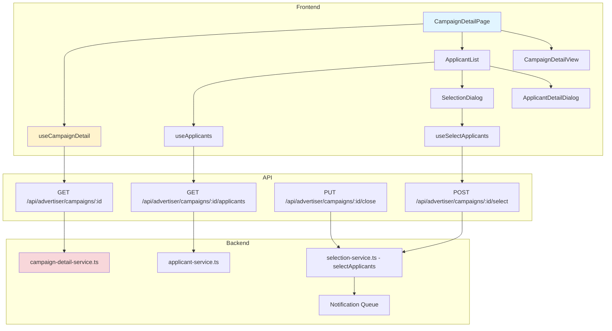
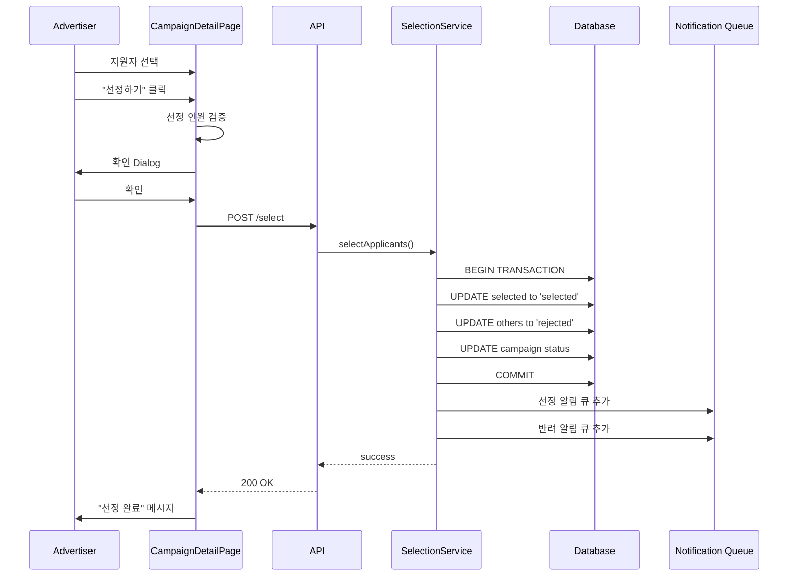

# UC-009: 광고주 체험단 상세 & 모집 관리 - 구현 계획

## 개요

### 모듈 목록

| 모듈 | 위치 | 설명 |
|------|------|------|
| **Backend - API Routes** | `src/features/advertiser/backend/routes/campaign-detail.ts` | 캠페인 상세/지원자 조회 API |
| **Backend - API Routes** | `src/features/advertiser/backend/routes/campaign-actions.ts` | 모집종료/선정 API |
| **Backend - Services** | `src/features/advertiser/backend/services/campaign-detail-service.ts` | 상세 조회 로직 |
| **Backend - Services** | `src/features/advertiser/backend/services/applicant-service.ts` | 지원자 목록 조회 |
| **Backend - Services** | `src/features/advertiser/backend/services/selection-service.ts` | 선정/반려 로직 |
| **Backend - Schema** | `src/features/advertiser/backend/schema/campaign-detail-schema.ts` | 상세/지원자 스키마 |
| **Backend - Schema** | `src/features/advertiser/backend/schema/selection-schema.ts` | 선정 스키마 |
| **Backend - Error** | `src/features/advertiser/backend/errors/campaign-detail-error.ts` | 에러 코드 정의 |
| **Frontend - Pages** | `src/app/(protected)/advertiser/campaigns/[id]/page.tsx` | 캠페인 상세 관리 페이지 |
| **Frontend - Components** | `src/features/advertiser/components/CampaignDetailView.tsx` | 캠페인 정보 표시 |
| **Frontend - Components** | `src/features/advertiser/components/ApplicantList.tsx` | 지원자 목록 테이블 |
| **Frontend - Components** | `src/features/advertiser/components/ApplicantDetailDialog.tsx` | 지원자 상세 Dialog |
| **Frontend - Components** | `src/features/advertiser/components/SelectionDialog.tsx` | 선정 확인 Dialog |
| **Frontend - Hooks** | `src/features/advertiser/hooks/useCampaignDetail.ts` | 캠페인 상세 조회 훅 |
| **Frontend - Hooks** | `src/features/advertiser/hooks/useApplicants.ts` | 지원자 목록 조회 훅 |
| **Frontend - Hooks** | `src/features/advertiser/hooks/useCloseCampaign.ts` | 모집 종료 훅 |
| **Frontend - Hooks** | `src/features/advertiser/hooks/useSelectApplicants.ts` | 선정 처리 훅 |

---

## Diagram





---

## Implementation Plan

### 1. Backend - Schema

```typescript
// src/features/advertiser/backend/schema/campaign-detail-schema.ts
export const CampaignDetailForAdvertiserSchema = z.object({
  id: z.string().uuid(),
  title: z.string(),
  description: z.string(),
  benefits: z.string(),
  mission: z.string(),
  location: z.string(),
  recruitmentStartDate: z.string(),
  recruitmentEndDate: z.string(),
  experienceStartDate: z.string(),
  experienceEndDate: z.string(),
  totalSlots: z.number(),
  selectedCount: z.number(),
  applicantCount: z.number(),
  status: z.enum(['recruiting', 'closed', 'selection_completed']),
  createdAt: z.string(),
});

export const ApplicantItemSchema = z.object({
  applicationId: z.string().uuid(),
  applicantId: z.string().uuid(),
  applicantName: z.string(),
  applicationMessage: z.string(),
  visitDate: z.string(),
  appliedAt: z.string(),
  status: z.enum(['pending', 'selected', 'rejected']),
  
  channels: z.array(z.object({
    id: z.string().uuid(),
    channelType: z.string(),
    channelName: z.string(),
    channelUrl: z.string(),
  })),
});

export const ApplicantsResponseSchema = z.object({
  applicants: z.array(ApplicantItemSchema),
  total: z.number(),
});

// src/features/advertiser/backend/schema/selection-schema.ts
export const SelectApplicantsRequestSchema = z.object({
  campaignId: z.string().uuid(),
  selectedApplicationIds: z.array(z.string().uuid()).min(1, '최소 1명 이상 선정해야 합니다'),
});

export type SelectApplicantsRequest = z.infer<typeof SelectApplicantsRequestSchema>;
```

---

### 2. Backend - Services

```typescript
// src/features/advertiser/backend/services/applicant-service.ts
export const getApplicants = async (
  client: SupabaseClient,
  advertiserId: string,
  campaignId: string
): Promise<HandlerResult<ApplicantsResponse, ServiceError, unknown>> => {
  try {
    // 1. 소유권 확인
    const { data: campaign } = await client
      .from('campaigns')
      .select('advertiser_id')
      .eq('id', campaignId)
      .single();

    if (!campaign) {
      return failure(404, 'NOT_FOUND', '캠페인을 찾을 수 없습니다');
    }

    if (campaign.advertiser_id !== advertiserId) {
      return failure(403, 'FORBIDDEN', '접근 권한이 없습니다');
    }

    // 2. 지원자 조회
    const { data, error } = await client
      .from('campaign_applications')
      .select(`
        id,
        user_id,
        application_message,
        visit_date,
        applied_at,
        status,
        applicant:users!inner(
          id,
          name
        ),
        channels:influencer_channels(
          id,
          channel_type,
          channel_name,
          channel_url
        )
      `)
      .eq('campaign_id', campaignId)
      .order('applied_at', { ascending: false });

    if (error) {
      return failure(500, 'FETCH_ERROR', '지원자 조회 실패', error);
    }

    const applicants = data.map((item: any) => ({
      applicationId: item.id,
      applicantId: item.user_id,
      applicantName: item.applicant.name,
      applicationMessage: item.application_message,
      visitDate: item.visit_date,
      appliedAt: item.applied_at,
      status: item.status,
      channels: item.channels.map((ch: any) => ({
        id: ch.id,
        channelType: ch.channel_type,
        channelName: ch.channel_name,
        channelUrl: ch.channel_url,
      })),
    }));

    return success({
      applicants,
      total: applicants.length,
    });

  } catch (error) {
    return failure(500, 'INTERNAL_ERROR', '오류 발생', error);
  }
};
```

```typescript
// src/features/advertiser/backend/services/selection-service.ts
export const closeCampaign = async (
  client: SupabaseClient,
  advertiserId: string,
  campaignId: string
): Promise<HandlerResult<void, ServiceError, unknown>> => {
  try {
    // 1. 소유권 및 상태 확인
    const { data: campaign } = await client
      .from('campaigns')
      .select('advertiser_id, status')
      .eq('id', campaignId)
      .single();

    if (!campaign) {
      return failure(404, 'NOT_FOUND', '캠페인을 찾을 수 없습니다');
    }

    if (campaign.advertiser_id !== advertiserId) {
      return failure(403, 'FORBIDDEN', '접근 권한이 없습니다');
    }

    if (campaign.status !== 'recruiting') {
      return failure(400, 'INVALID_STATUS', '모집 중인 캠페인만 종료할 수 있습니다');
    }

    // 2. 상태 업데이트
    const { error } = await client
      .from('campaigns')
      .update({ status: 'closed' })
      .eq('id', campaignId);

    if (error) {
      return failure(500, 'UPDATE_FAILED', '모집 종료 실패', error);
    }

    return success(undefined);

  } catch (error) {
    return failure(500, 'INTERNAL_ERROR', '오류 발생', error);
  }
};

export const selectApplicants = async (
  client: SupabaseClient,
  advertiserId: string,
  request: SelectApplicantsRequest
): Promise<HandlerResult<void, SelectionServiceError, unknown>> => {
  try {
    // 1. 캠페인 확인
    const { data: campaign } = await client
      .from('campaigns')
      .select('advertiser_id, status, total_slots')
      .eq('id', request.campaignId)
      .single();

    if (!campaign) {
      return failure(404, errorCodes.campaignNotFound, '캠페인을 찾을 수 없습니다');
    }

    if (campaign.advertiser_id !== advertiserId) {
      return failure(403, errorCodes.forbidden, '접근 권한이 없습니다');
    }

    if (campaign.status === 'selection_completed') {
      return failure(400, errorCodes.alreadyCompleted, '이미 선정이 완료되었습니다');
    }

    // 2. 선정 인원 검증
    if (request.selectedApplicationIds.length > campaign.total_slots) {
      return failure(400, errorCodes.exceededSlots, 
        `모집 인원을 초과할 수 없습니다 (최대 ${campaign.total_slots}명)`);
    }

    // 3. 트랜잭션 시작 (Supabase RPC 사용 또는 순차 실행)
    // 선정된 지원자: selected
    const { error: selectError } = await client
      .from('campaign_applications')
      .update({ status: 'selected' })
      .eq('campaign_id', request.campaignId)
      .in('id', request.selectedApplicationIds);

    if (selectError) {
      return failure(500, errorCodes.updateFailed, '선정 처리 실패', selectError);
    }

    // 미선정 지원자: rejected
    const { error: rejectError } = await client
      .from('campaign_applications')
      .update({ status: 'rejected' })
      .eq('campaign_id', request.campaignId)
      .not('id', 'in', `(${request.selectedApplicationIds.join(',')})`);

    if (rejectError) {
      // 롤백 필요 (또는 트랜잭션 사용)
      return failure(500, errorCodes.updateFailed, '반려 처리 실패', rejectError);
    }

    // 캠페인 상태 업데이트
    const { error: campaignError } = await client
      .from('campaigns')
      .update({
        status: 'selection_completed',
        selected_count: request.selectedApplicationIds.length,
      })
      .eq('id', request.campaignId);

    if (campaignError) {
      return failure(500, errorCodes.updateFailed, '캠페인 업데이트 실패', campaignError);
    }

    // 4. 알림 큐 추가 (비동기)
    // await addToNotificationQueue('selected', selectedApplicantIds);
    // await addToNotificationQueue('rejected', rejectedApplicantIds);

    return success(undefined);

  } catch (error) {
    return failure(500, errorCodes.internalError, '선정 처리 중 오류 발생', error);
  }
};
```

**Unit Tests:**
```typescript
describe('SelectionService', () => {
  describe('closeCampaign', () => {
    it('should close recruiting campaign', async () => {
      const result = await closeCampaign(mockClient, 'advertiser-id', 'campaign-id');
      expect(result.ok).toBe(true);
    });

    it('should reject if not recruiting', async () => {
      const result = await closeCampaign(mockClient, 'advertiser-id', 'closed-id');
      expect(result.ok).toBe(false);
    });
  });

  describe('selectApplicants', () => {
    it('should select applicants successfully', async () => {
      const request = {
        campaignId: 'campaign-id',
        selectedApplicationIds: ['app-1', 'app-2'],
      };
      const result = await selectApplicants(mockClient, 'advertiser-id', request);
      expect(result.ok).toBe(true);
    });

    it('should reject if exceeds total slots', async () => {
      const request = {
        campaignId: 'campaign-id',
        selectedApplicationIds: ['app-1', 'app-2', 'app-3', 'app-4', 'app-5', 'app-6'],
      };
      const result = await selectApplicants(mockClient, 'advertiser-id', request);
      expect(result.ok).toBe(false);
    });

    it('should set unselected to rejected', async () => {
      // Verify UPDATE with NOT IN was called
      expect(mockClient.from('campaign_applications').update).toHaveBeenCalledWith(
        { status: 'rejected' }
      );
    });
  });
});
```

---

### 3. Frontend - Components

```typescript
// src/features/advertiser/components/ApplicantList.tsx
export const ApplicantList = ({ campaignId }: { campaignId: string }) => {
  const { data: applicants, isLoading } = useApplicants(campaignId);
  const [selectedIds, setSelectedIds] = useState<string[]>([]);
  const [detailDialogOpen, setDetailDialogOpen] = useState(false);
  const [selectedApplicant, setSelectedApplicant] = useState<ApplicantItem | null>(null);
  const [selectionDialogOpen, setSelectionDialogOpen] = useState(false);

  const handleRowClick = (applicant: ApplicantItem) => {
    setSelectedApplicant(applicant);
    setDetailDialogOpen(true);
  };

  const handleSelect = () => {
    setSelectionDialogOpen(true);
  };

  if (isLoading) return <Skeleton />;
  if (!applicants || applicants.length === 0) {
    return <EmptyState title="아직 지원자가 없습니다" />;
  }

  return (
    <>
      <div className="space-y-4">
        <div className="flex justify-between items-center">
          <h3 className="text-lg font-semibold">
            지원자 목록 ({applicants.length}명)
          </h3>
          <Button
            onClick={handleSelect}
            disabled={selectedIds.length === 0}
          >
            선정하기 ({selectedIds.length}명)
          </Button>
        </div>

        <Table>
          <TableHeader>
            <TableRow>
              <TableHead className="w-12">
                <Checkbox
                  checked={selectedIds.length === applicants.length}
                  onCheckedChange={(checked) => {
                    setSelectedIds(checked ? applicants.map(a => a.applicationId) : []);
                  }}
                />
              </TableHead>
              <TableHead>이름</TableHead>
              <TableHead>채널</TableHead>
              <TableHead>방문 예정일</TableHead>
              <TableHead>지원일</TableHead>
              <TableHead>상태</TableHead>
            </TableRow>
          </TableHeader>
          <TableBody>
            {applicants.map((applicant) => (
              <TableRow
                key={applicant.applicationId}
                className="cursor-pointer hover:bg-gray-50"
                onClick={() => handleRowClick(applicant)}
              >
                <TableCell onClick={(e) => e.stopPropagation()}>
                  <Checkbox
                    checked={selectedIds.includes(applicant.applicationId)}
                    onCheckedChange={(checked) => {
                      setSelectedIds(prev =>
                        checked
                          ? [...prev, applicant.applicationId]
                          : prev.filter(id => id !== applicant.applicationId)
                      );
                    }}
                  />
                </TableCell>
                <TableCell>{applicant.applicantName}</TableCell>
                <TableCell>
                  {applicant.channels.map(ch => (
                    <Badge key={ch.id} variant="outline" className="mr-1">
                      {ch.channelType}
                    </Badge>
                  ))}
                </TableCell>
                <TableCell>{formatDate(applicant.visitDate)}</TableCell>
                <TableCell>{formatDate(applicant.appliedAt)}</TableCell>
                <TableCell>
                  <ApplicationStatusBadge status={applicant.status} />
                </TableCell>
              </TableRow>
            ))}
          </TableBody>
        </Table>
      </div>

      <ApplicantDetailDialog
        applicant={selectedApplicant}
        open={detailDialogOpen}
        onClose={() => setDetailDialogOpen(false)}
      />

      <SelectionDialog
        campaignId={campaignId}
        selectedIds={selectedIds}
        open={selectionDialogOpen}
        onClose={() => setSelectionDialogOpen(false)}
        onSuccess={() => {
          setSelectedIds([]);
          setSelectionDialogOpen(false);
        }}
      />
    </>
  );
};
```

```typescript
// src/features/advertiser/components/SelectionDialog.tsx
export const SelectionDialog = ({
  campaignId,
  selectedIds,
  open,
  onClose,
  onSuccess,
}: SelectionDialogProps) => {
  const selectApplicants = useSelectApplicants();
  const { data: campaign } = useCampaignDetail(campaignId);

  const handleConfirm = async () => {
    try {
      await selectApplicants.mutateAsync({
        campaignId,
        selectedApplicationIds: selectedIds,
      });
      toast.success('선정이 완료되었습니다!');
      onSuccess();
    } catch (error: any) {
      toast.error(error.message || '선정 처리 중 오류가 발생했습니다');
    }
  };

  const exceededSlots = campaign && selectedIds.length > campaign.totalSlots;

  return (
    <Dialog open={open} onOpenChange={onClose}>
      <DialogContent>
        <DialogHeader>
          <DialogTitle>선정 확인</DialogTitle>
        </DialogHeader>

        <div className="space-y-4">
          <p>
            <strong>{selectedIds.length}명</strong>을 선정하시겠습니까?
          </p>

          {exceededSlots && (
            <Alert variant="destructive">
              <AlertDescription>
                모집 인원({campaign.totalSlots}명)을 초과했습니다. 
                {selectedIds.length - campaign.totalSlots}명을 선택 해제해주세요.
              </AlertDescription>
            </Alert>
          )}

          <Alert>
            <AlertDescription>
              선정되지 않은 지원자는 자동으로 반려됩니다.
            </AlertDescription>
          </Alert>
        </div>

        <DialogFooter>
          <Button variant="outline" onClick={onClose}>
            취소
          </Button>
          <Button
            onClick={handleConfirm}
            disabled={selectApplicants.isPending || exceededSlots}
          >
            {selectApplicants.isPending ? '처리 중...' : '확인'}
          </Button>
        </DialogFooter>
      </DialogContent>
    </Dialog>
  );
};
```

**QA Sheet:**
```markdown
## Visual Tests
- [ ] 지원자 테이블이 깔끔하게 표시되는가?
- [ ] 체크박스 선택이 명확한가?
- [ ] 상태 뱃지가 구분되는가?

## Functional Tests
- [ ] 전체 선택/해제가 작동하는가?
- [ ] 개별 선택이 작동하는가?
- [ ] 행 클릭 시 상세 Dialog가 열리는가?
- [ ] 선정 인원 초과 시 경고 표시되는가?
- [ ] 선정 완료 후 상태가 업데이트되는가?

## Permission Tests
- [ ] 타인의 캠페인 접근 시 403 처리되는가?
- [ ] 이미 선정 완료된 캠페인 수정 불가한가?

## Data Integrity Tests
- [ ] 트랜잭션 실패 시 롤백되는가?
- [ ] 선정/반려 상태가 정확히 업데이트되는가?
```

---

## Summary

### 구현 순서
1. **Phase 1**: Schema & Error (Detail, Selection)
2. **Phase 2**: Backend Services (Applicants, Close, Select)
3. **Phase 3**: API Routes
4. **Phase 4**: Frontend Hooks
5. **Phase 5**: UI Components (List, Detail Dialog, Selection Dialog)
6. **Phase 6**: Page Integration
7. **Phase 7**: Notification Queue Integration (비동기)

### 테스트 체크리스트
- [ ] 지원자 목록 조회 (권한 확인)
- [ ] 모집 종료
- [ ] 선정 처리 (인원 검증)
- [ ] 상태 업데이트 (트랜잭션)
- [ ] 알림 큐 통합

### 주요 고려사항
1. **트랜잭션**: 선정 처리 시 원자성 보장 (Supabase RPC 함수 사용 권장)
2. **알림**: 선정/반려 알림 큐 시스템 구축 (비동기 처리)
3. **권한**: RLS 정책으로 본인 캠페인만 접근 가능하도록 설정
4. **UX**: 선정 중 로딩 상태, 에러 처리, 성공 피드백 명확히

