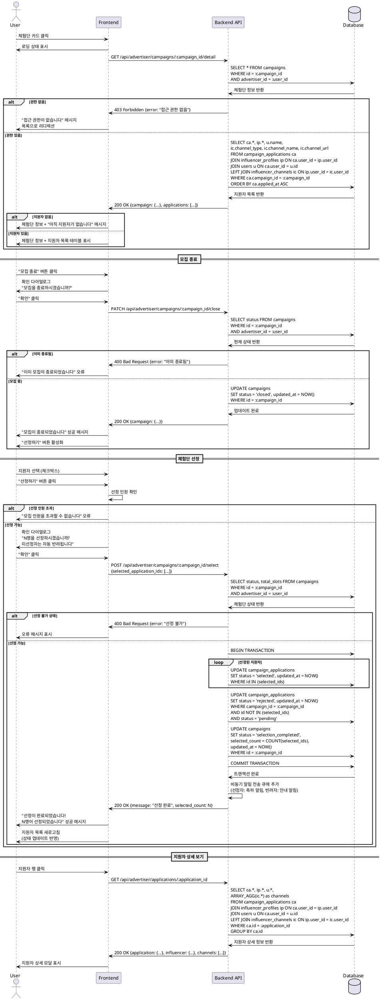

# UC-009: 광고주 체험단 상세 & 모집 관리

## Primary Actor
- 광고주 (본인이 등록한 체험단)

## Precondition
- 로그인된 상태
- 역할이 '광고주'
- 본인이 등록한 체험단에 접근
- 체험단 관리 페이지에서 특정 체험단 선택

## Trigger
- 체험단 관리 목록에서 체험단 카드 클릭
- "상세/관리" 버튼 클릭

## Main Scenario

### 1. 체험단 상세 관리 페이지 접근
1. 사용자가 체험단 카드를 클릭한다
2. 시스템이 체험단 상세 관리 페이지를 표시한다:
   - 체험단 기본 정보 (읽기 전용)
   - 모집 현황 섹션
   - 지원자 목록 테이블
   - 관리 액션 버튼 (모집종료, 선정하기)

### 2. 체험단 정보 표시
1. 시스템이 체험단 상세 정보를 표시한다:
   - 제목, 설명, 혜택, 미션, 위치
   - 모집 기간, 체험 기간
   - 모집 인원 (지원자 수 / 총 모집 인원)
   - 현재 상태 (모집 중 / 모집 종료 / 선정 완료)

### 3. 지원자 목록 표시
1. 시스템이 지원자 목록을 조회한다
2. 시스템이 테이블 형태로 지원자 정보를 표시한다:
   - 인플루언서 이름
   - SNS 채널 정보 (유형, 채널명, URL 링크)
   - 각오 한마디
   - 방문 예정일자
   - 지원 일시
   - 지원 상태 (대기중 / 선정 / 반려)
   - 액션 (선정하기, 반려하기 체크박스 또는 버튼)
3. 지원자가 없으면 "아직 지원자가 없습니다" 메시지 표시

### 4. 지원자 상세 정보 확인
1. 사용자가 지원자 행을 클릭한다
2. 시스템이 지원자 상세 정보를 표시한다 (모달 또는 확장):
   - 인플루언서 프로필 정보
   - 모든 SNS 채널 목록
   - 각오 한마디 (전체 내용)
   - 방문 예정일자
   - 지원 일시

### 5. 모집 종료
1. 사용자가 "모집 종료" 버튼을 클릭한다
2. 시스템이 확인 다이얼로그를 표시한다:
   - "모집을 종료하시겠습니까?"
   - "종료 후에는 지원자가 추가로 지원할 수 없습니다"
3. 사용자가 "확인" 버튼을 클릭한다
4. 시스템이 체험단 상태를 변경한다:
   - `campaigns.status = 'recruiting'` → `'closed'`
5. 시스템이 "모집이 종료되었습니다" 메시지를 표시한다
6. 시스템이 "선정하기" 버튼을 활성화한다

### 6. 체험단 선정 프로세스
1. 사용자가 선정할 지원자를 선택한다 (체크박스)
2. 사용자가 "선정하기" 버튼을 클릭한다
3. 시스템이 선정 확인 다이얼로그를 표시한다:
   - "N명을 선정하시겠습니까?"
   - "선정되지 않은 지원자는 자동으로 반려됩니다"
   - 선정 인원 확인 (총 모집 인원 초과 경고)
4. 사용자가 "확인" 버튼을 클릭한다
5. 시스템이 선정 처리를 수행한다:
   - 선택된 지원자: `status = 'selected'`
   - 미선택 지원자: `status = 'rejected'`
   - `campaigns.status = 'selection_completed'`
   - `campaigns.selected_count = 선정 인원 수`
6. 시스템이 "선정이 완료되었습니다" 메시지를 표시한다
7. 시스템이 인플루언서들에게 알림을 전송한다 (비동기):
   - 선정: "축하합니다! 체험단에 선정되었습니다"
   - 반려: "아쉽게도 이번에는 선정되지 않았습니다"

### 7. 개별 선정/반려 (선택사항)
1. 사용자가 특정 지원자의 "선정" 또는 "반려" 버튼을 클릭한다
2. 시스템이 해당 지원자의 상태를 변경한다
3. 시스템이 지원자에게 알림을 전송한다

### 8. 선정 결과 확인
1. 시스템이 선정된 지원자 목록을 표시한다
2. 시스템이 선정 인원 / 총 모집 인원을 업데이트하여 표시한다
3. 사용자가 선정 결과를 확인한다

## Edge Cases

### 지원자가 없을 때 모집 종료
- **발생 조건**: 지원자가 0명인 상태에서 모집 종료
- **처리**: "지원자가 없습니다. 그래도 종료하시겠습니까?" 경고

### 지원자가 없을 때 선정
- **발생 조건**: 지원자가 0명인 상태에서 선정 시도
- **처리**: "지원자가 없어 선정할 수 없습니다" 오류 메시지

### 선정 인원 초과
- **발생 조건**: 모집 인원보다 많은 지원자 선정 시도
- **처리**: "모집 인원을 초과할 수 없습니다 (최대 N명)" 경고, 제출 불가

### 이미 모집 종료된 체험단
- **발생 조건**: `status = 'closed'` 상태에서 모집 종료 시도
- **처리**: "이미 모집이 종료되었습니다" 메시지, 버튼 비활성화

### 이미 선정 완료된 체험단
- **발생 조건**: `status = 'selection_completed'` 상태
- **처리**: 선정 결과만 표시, 수정 불가 (또는 재선정 옵션)

### 선정 중 지원자 삭제
- **발생 조건**: 지원자가 지원을 취소하거나 삭제됨
- **처리**: 해당 지원자 제외하고 선정 진행, 경고 메시지

### 네트워크 오류
- **발생 조건**: 선정 처리 중 오류 발생
- **처리**: "일시적인 오류가 발생했습니다" 메시지, 트랜잭션 롤백

### 타인의 체험단 접근
- **발생 조건**: 다른 광고주의 체험단 접근 시도
- **처리**: "접근 권한이 없습니다" 메시지, 목록으로 리디렉션

### 알림 전송 실패
- **발생 조건**: 인플루언서 알림 전송 실패
- **처리**: 선정은 완료, 알림 재시도 스케줄링, 관리자 로그

### 모집 기간 자동 종료
- **발생 조건**: `recruitment_end_date < NOW()` 도달
- **처리**: 자동으로 상태 변경 (Cron Job 또는 조회 시 체크)

## Business Rules

### BR-081: 접근 권한
- 본인이 등록한 체험단만 관리 가능
- `campaigns.advertiser_id = current_user.id`

### BR-082: 모집 종료 조건
- 모집 중(`recruiting`) 상태에서만 종료 가능
- 종료 후 신규 지원 불가

### BR-083: 선정 가능 조건
- 모집 종료(`closed`) 상태에서 선정 가능
- 또는 모집 중 상태에서도 선정 가능 (정책에 따라)

### BR-084: 선정 인원 제한
- 선정 인원은 총 모집 인원 이하
- `selected_count <= total_slots`

### BR-085: 자동 반려 처리
- 선정 시 선택되지 않은 모든 지원자는 자동 반려
- `status = 'rejected'`

### BR-086: 상태 전환 순서
- `recruiting` → `closed` → `selection_completed`
- 역방향 전환 불가 (또는 제한적 허용)

### BR-087: 선정 결과 확정
- 선정 완료 후 수정 불가 (또는 재선정 허용)
- 변경 시 감사 로그 기록

### BR-088: 지원자 정보 표시
- 인플루언서의 기본 정보 및 채널 정보 표시
- 개인정보는 필요한 범위만 제공

### BR-089: 알림 전송
- 선정/반려 결과를 인플루언서에게 알림 (이메일, 푸시)
- 비동기 처리로 응답 지연 방지

### BR-090: 지원자 목록 정렬
- 지원 일시 기준 오름차순 (선착순)
- 또는 광고주가 정렬 기준 선택 가능

---

## Sequence Diagram

---

## Notes

### 구현 우선순위
1. **High**: 지원자 목록 조회 및 표시
2. **High**: 모집 종료 및 선정 기능
3. **Medium**: 지원자 상세 정보 조회
4. **Medium**: 알림 전송
5. **Low**: 개별 선정/반려
6. **Low**: 선정 결과 수정 (재선정)

### 기술적 고려사항
- 권한 확인 (RLS 또는 애플리케이션 레벨)
- 트랜잭션 처리 (선정 프로세스)
- 알림 큐 (비동기 처리)
- 지원자 목록 JOIN 쿼리 최적화
- 상태 전환 검증
- 감사 로그 기록

### UI/UX 고려사항
- 지원자 목록 테이블 디자인
- 체크박스 선택 UI
- 선정 인원 초과 경고 명확히
- 확인 다이얼로그 강조
- 상태 배지 색상 일관성
- 지원자 상세 모달
- 선정 완료 후 피드백
- 반응형 테이블 (모바일)
- 선정 진행 상태 표시

